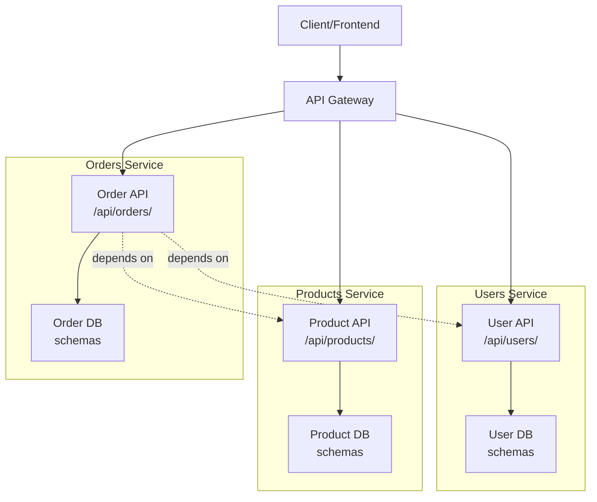
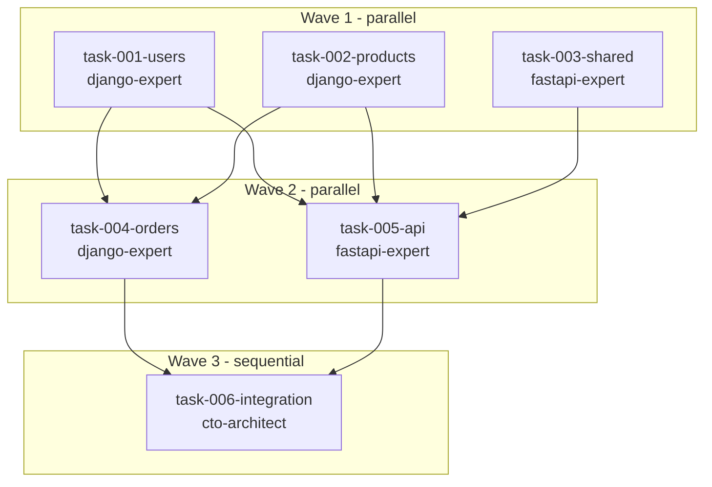
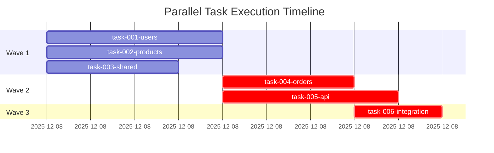

# parallel-decompose

**Category**: Parallel Development

## Usage

```bash
/parallel-decompose <prd-file> --tech-spec <ts-file> [--tech django|typescript|go]
/parallel-decompose <prd-file> --name <slug> [--tech django|typescript|go]
```

## Arguments

- `<prd-file>`: Required - Path to PRD or FRD file to decompose
- `--tech-spec`: Recommended - Path to Tech Spec file (determines folder name: `TS-XXXX-slug`)
- `--name`: Fallback - Manual slug if no Tech Spec (creates `parallel/{slug}/`)
- `--tech`: Optional - Technology stack (default: auto-detect)

## Purpose

Decompose a PRD into independent, parallel-executable task specifications. This all-in-one command:
1. Creates `parallel/TS-XXXX-slug/` directory
2. Generates contracts, tasks, prompts, and scripts
3. Creates manifest.json for regeneration

> Combines former `/parallel-setup` + `/parallel-decompose` + `/parallel-prompts` into one command.

## Prerequisites

- Run `/parallel-setup` once (creates `parallel/` root directory)
- Tech Spec recommended (provides design decisions and contracts)

## Execution Method

This command **delegates to the `cto-architect` agent** (Opus model) for high-quality decomposition.

### Why CTO-Architect?

| Factor | Benefit |
|--------|---------|
| **Model** | Uses Opus (best reasoning for architectural decisions) |
| **Expertise** | Built-in task breakdown workflow (Phase 3) |
| **Quality** | Expert in architecture, contracts, boundaries |
| **Skills** | Has RFC + Tech Spec creation capabilities |

### Delegation Instructions

When this command is invoked, Claude Code should:

1. **Parse arguments** to extract PRD path, Tech Spec path, and technology stack
2. **Determine output directory** (see Step 0 below)
3. **Spawn the CTO-architect agent** using the Task tool:

```
Use the Task tool with:
- subagent_type: devops-data:cto-architect
- model: opus (inherited from agent definition)
```

**Delegation prompt for the agent:**

```
You are decomposing a PRD into parallel-executable tasks for multi-agent development.

**Inputs:**
- PRD: {prd_file_path}
- Tech Spec: {tech_spec_path} (or "not provided")
- Technology: {tech_stack}
- Output Directory: {parallel_dir}

**Your task:**
1. Read the PRD and Tech Spec (if provided)
2. Create the output directory structure: {parallel_dir}/{tasks,contracts,prompts}
3. Follow the decomposition process detailed below (Steps 1-10)
4. Generate all artifacts:
   - manifest.json (regeneration metadata)
   - context.md (shared project context)
   - contracts/ (types.py, api-schema.yaml)
   - tasks/ (compact YAML format task specs)
   - prompts/ (agent-prompts.md + individual task-*.txt)
   - architecture.md
   - task-graph.md

**Key requirements:**
- Use compact YAML task format with frontmatter
- Create shared context.md for token efficiency
- Assign appropriate agent types to tasks (django-expert, fastapi-expert, react-typescript-expert, etc.)

**Report back with:**
- Output directory path
- Number of tasks created
- Number of waves
- Max parallelization per wave
- Critical path
```

---

## Decomposition Process (Executed by CTO-Architect)

The following steps are executed by the spawned cto-architect agent:

### 0. Determine Output Directory

**If `--tech-spec` provided**:
1. Read Tech Spec file, extract `tech_spec_id` (e.g., `TS-0042`)
2. Extract slug from title (e.g., `inventory-system`)
3. Output to: `parallel/TS-0042-inventory-system/`

**If `--name` provided** (fallback):
1. Use provided slug
2. Output to: `parallel/{slug}/`

**If neither**:
- Error: "Provide --tech-spec or --name to identify output directory"

### 1. Create Directory Structure

```bash
PARALLEL_DIR="parallel/TS-0042-inventory-system"
mkdir -p "$PARALLEL_DIR"/{tasks,contracts,prompts,scripts}
```

### 2. Create manifest.json

Create `$PARALLEL_DIR/manifest.json`:
```json
{
  "tech_spec_id": "TS-0042",
  "name": "inventory-system",
  "technology": "django",
  "waves": [
    {
      "number": 1,
      "tasks": [
        {
          "id": "task-001",
          "component": "users",
          "agent": "python-experts:django-expert"
        },
        {
          "id": "task-002",
          "component": "products",
          "agent": "python-experts:django-expert"
        },
        {
          "id": "task-003",
          "component": "shared",
          "agent": "python-experts:fastapi-expert"
        }
      ],
      "validation": "pytest apps/users/ && pytest apps/products/ && mypy apps/users/ apps/products/"
    },
    {
      "number": 2,
      "tasks": [
        {
          "id": "task-004",
          "component": "orders",
          "agent": "python-experts:django-expert"
        },
        {
          "id": "task-005",
          "component": "api",
          "agent": "python-experts:fastapi-expert"
        }
      ],
      "validation": "pytest apps/orders/ && mypy apps/orders/"
    },
    {
      "number": 3,
      "tasks": [
        {
          "id": "task-006",
          "component": "integration",
          "agent": "devops-data:cto-architect"
        }
      ],
      "validation": "pytest integration/ && ruff check . && mypy ."
    }
  ],
  "metadata": {
    "created_at": "2025-12-07T14:30:00Z",
    "sources": {
      "prd": "docs/prds/inventory-prd.md",
      "tech_spec": "tech-specs/approved/TS-0042-inventory-system.md"
    }
  }
}
```

### 3. Create context.md (Shared Project Context)

Create `$PARALLEL_DIR/context.md` - shared context for all tasks (token-efficient):
```markdown
# Project Context

## Overview
[Brief project description from PRD]

## Technology Stack
- Backend: Django 5.x / Python 3.12
- Database: PostgreSQL
- Testing: pytest, Factory Boy

## Conventions
- Follow CLAUDE.md guidelines
- Use explicit serializer fields (no `__all__`)
- Type hints required (mypy strict)
- ruff for linting

## Key Directories
- `apps/` - Django applications
- `config/` - Django settings
- `tests/` - Integration tests

## Contracts Location
- Types: `contracts/types.py`
- API: `contracts/api-schema.yaml`
```

### 4. Create Contracts

**From Tech Spec** (preferred): Extract Data Model and API sections.

**From PRD** (fallback): Generate types and endpoints.

**Create `$PARALLEL_DIR/contracts/types.py`** (or `.ts`):
```python
"""
Shared domain types for parallel agents.
DO NOT MODIFY during parallel execution.
"""
from dataclasses import dataclass
from datetime import datetime
from enum import Enum

@dataclass(frozen=True)
class UserDTO:
    id: int
    email: str
    name: str
    created_at: datetime

# ... entities from Tech Spec Data Model
```

**Create `$PARALLEL_DIR/contracts/api-schema.yaml`**:
```yaml
openapi: 3.0.3
info:
  title: Project API
  version: 1.0.0

paths:
  /api/users/:
    get:
      operationId: listUsers
      responses:
        '200':
          content:
            application/json:
              schema:
                $ref: '#/components/schemas/UserList'
  # ... endpoints from Tech Spec API section

components:
  schemas:
    # ... schemas from Tech Spec
```

### 5. Create architecture.md

Create `$PARALLEL_DIR/architecture.md`:
```markdown
# System Architecture

## Overview
[From Tech Spec Design Overview or PRD summary]

## Component Diagram



## Components

| Component | Directory | Owner Task | Dependencies |
|-----------|-----------|------------|--------------|
| Users | apps/users/ | task-001 | None |
| Products | apps/products/ | task-002 | None |
| Orders | apps/orders/ | task-004 | task-001, task-002 |

## Boundaries

Each task owns specific directories. No cross-boundary modifications during parallel execution.

## Integration Points

Integration happens after all parallel work completes:

1. Migration merge
2. Integration tests
3. Contract compliance verification

```

### 6. Generate Task Files (Compact YAML Format)

Create tasks in `$PARALLEL_DIR/tasks/`:

**Naming**: `task-{NNN}-{component}.md`

**Compact format** (token-efficient):
```yaml
---
id: task-001
component: users
wave: 1
deps: []
blocks: [task-004, task-005]
agent: django-expert
tech_spec: TS-0042
contracts: [contracts/types.py, contracts/api-schema.yaml]
---
# task-001: User Management

## Scope
CREATE: apps/users/{models,views,serializers,urls}.py, apps/users/tests/*.py
MODIFY: config/urls.py
BOUNDARY: apps/orders/*, apps/products/*, apps/*/migrations/*

## Requirements
- User model with email authentication
- UserSerializer with explicit fields
- UserViewSet (list, retrieve, create, update)
- Email uniqueness validation

## Checklist
- [ ] Model matches UserDTO in contracts/types.py
- [ ] API matches /api/users/* in contracts/api-schema.yaml
- [ ] pytest apps/users/ passes
- [ ] mypy apps/users/ passes
- [ ] ruff check apps/users/ passes
- [ ] No files modified outside scope
```

### 7. Create task-graph.md

Create `$PARALLEL_DIR/task-graph.md` using **Mermaid flowchart** for dependency visualization:

```markdown
# Task Dependency Graph

## Dependency Visualization



## Wave Summary

| Wave | Tasks | Parallel Agents |
|------|-------|-----------------|
| 1 | task-001, task-002, task-003 | 3 |
| 2 | task-004, task-005 | 2 |
| 3 | task-006 | 1 |

## Wave Execution Order



## Critical Path

`task-001 → task-004 → task-006` (3 waves)

## Stats

- Total tasks: 6
- Max parallel agents: 3
- Waves: 3
```

**Mermaid conventions**:
- `flowchart TB` for top-to-bottom flow
- `subgraph W{N}[Wave N - parallel/sequential]` groups tasks by wave
- Node format: `t{NNN}[task-{NNN}-{component}<br/>{agent}]`
- Edges: `t001 --> t004` for dependencies

### 8. Generate Prompts

Create `$PARALLEL_DIR/prompts/agent-prompts.md`:
```markdown
# Agent Execution Prompts

Generated: 2025-12-07
Source PRD: docs/prds/inventory-prd.md
Tech Spec: TS-0042-inventory-system

## Wave 1 (Run in Parallel)

### task-001-users
**Agent**: django-expert
**Launch**:
```bash
cd ../workspace-task-001
claude --dangerously-skip-permissions --print "Execute task from parallel/TS-0042-inventory-system/tasks/task-001-users.md. Read context from parallel/TS-0042-inventory-system/context.md first."
```

### task-002-products
**Agent**: django-expert
**Launch**:
```bash
cd ../workspace-task-002
claude --dangerously-skip-permissions --print "Execute task from parallel/TS-0042-inventory-system/tasks/task-002-products.md. Read context from parallel/TS-0042-inventory-system/context.md first."
```
```

Create individual prompt files `$PARALLEL_DIR/prompts/task-{NNN}.txt` with explicit execution instructions:

```
TASK-001: User Management
Agent: django-expert
Wave: 1 (No dependencies - can start immediately)

=== OBJECTIVE ===
Implement user management module with CRUD operations and authentication hooks.

=== CONTEXT ===
You are implementing the users app for an inventory management system.
Reference: tech-specs/approved/TS-0042-inventory-system.md (Section: Users Module)
Contracts: parallel/TS-0042-inventory-system/contracts/

=== FILES TO CREATE ===
1. apps/users/models.py - User and Profile models
2. apps/users/views.py - API views
3. apps/users/tests/test_models.py - Model tests

=== FILES TO MODIFY ===
1. config/urls.py - Add users app URLs

=== DO NOT MODIFY ===
- apps/products/* (owned by task-002)
- apps/orders/* (owned by task-003)

=== IMPLEMENTATION REQUIREMENTS ===
[Requirements from task spec...]

=== ACCEPTANCE CRITERIA ===
[ ] All models created with proper fields
[ ] API endpoints functional
[ ] Unit tests pass
[ ] No modifications outside scope

=== EXECUTION INSTRUCTIONS ===

You MUST write code, not just describe it. Follow these steps:

1. **Read first**: Read Tech Spec, Contracts, and existing code in scope
2. **Implement**: Use Write tool for new files, Edit tool for modifications
3. **Test**: Run tests to verify implementation
4. **Commit**: Create atomic commits as you complete each part

IMPORTANT RULES:
- Do NOT ask for confirmation - proceed with implementation immediately
- Do NOT just describe what you would do - actually write the code
- Do NOT modify files listed in "DO NOT MODIFY" section
- Do NOT skip writing tests

COMPLETION SIGNAL:
Upon successful completion (all criteria met, tests passing), run:
  touch .claude-task-complete
```

**Critical prompt elements** (must be in every prompt):
- Explicit "You MUST write code" instruction
- Tool names (Write, Edit) called out
- "Do NOT ask for confirmation" directive
- DO NOT MODIFY boundary enforcement
- Completion marker instruction

### 9. Update manifest.json

Update manifest with final task list and validation commands (already created in step 2, update wave structure with actual tasks):
```json
{
  "tech_spec_id": "TS-0042",
  "name": "inventory-system",
  "technology": "django",
  "waves": [
    {
      "number": 1,
      "tasks": [
        {"id": "task-001", "component": "users", "agent": "python-experts:django-expert"},
        {"id": "task-002", "component": "products", "agent": "python-experts:django-expert"}
      ],
      "validation": "pytest apps/users/ && pytest apps/products/ && mypy apps/users/ apps/products/"
    },
    {
      "number": 2,
      "tasks": [
        {"id": "task-003", "component": "orders", "agent": "python-experts:django-expert"}
      ],
      "validation": "pytest apps/orders/ && mypy apps/orders/"
    }
  ],
  "metadata": {
    "created_at": "2025-12-07T14:30:00Z",
    "sources": {
      "prd": "docs/prds/inventory-prd.md",
      "tech_spec": "tech-specs/approved/TS-0042-inventory-system.md"
    }
  }
}
```

### 10. Report Results

```
Decomposition Complete

Output: parallel/TS-0042-inventory-system/
Source: docs/prds/inventory-prd.md
Tech Spec: TS-0042-inventory-system

├── manifest.json           # Regeneration metadata
├── context.md              # Shared project context
├── contracts/
│   ├── types.py            # 5 entities
│   └── api-schema.yaml     # 12 endpoints
├── tasks/
│   ├── task-001-users.md
│   ├── task-002-products.md
│   └── ... (6 tasks total)
├── prompts/
│   ├── agent-prompts.md    # All launch commands
│   └── task-*.txt          # Individual prompts
├── architecture.md
└── task-graph.md

Summary:
- Tasks: 6
- Waves: 3
- Max parallel agents: 3

Next steps:
1. Review tasks in parallel/TS-0042-inventory-system/tasks/
2. Run `cpo run parallel/TS-0042-inventory-system/tasks` to execute all tasks
3. Run `/parallel-integrate` to verify
```

## Example

```bash
# With Tech Spec (recommended)
/parallel-decompose docs/inventory-prd.md --tech-spec tech-specs/approved/TS-0042-inventory.md

# With technology hint
/parallel-decompose docs/inventory-prd.md --tech-spec tech-specs/approved/TS-0042-inventory.md --tech django

# Without Tech Spec (fallback)
/parallel-decompose docs/auth-frd.md --name user-auth --tech django
```

## Key Principles

1. **Contract-first**: Define types and API schemas before tasks
2. **Compact tasks**: YAML frontmatter + bullet lists for token efficiency
3. **Shared context**: `context.md` avoids duplicating project info
4. **Explicit boundaries**: Each task owns specific files
5. **2-4 hour granularity**: Not too big, not too small
6. **Reference prompts**: Point to files instead of embedding content

## Related Commands

- `/parallel-setup` - One-time project initialization
- `/parallel-run` - Execute and monitor parallel agents
- `/parallel-integrate` - Verify integration after execution
- `/create-tech-spec` - Create Tech Spec before decomposition
