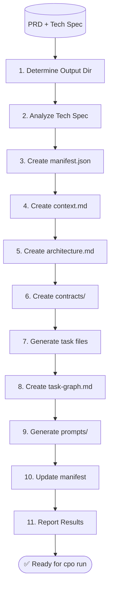
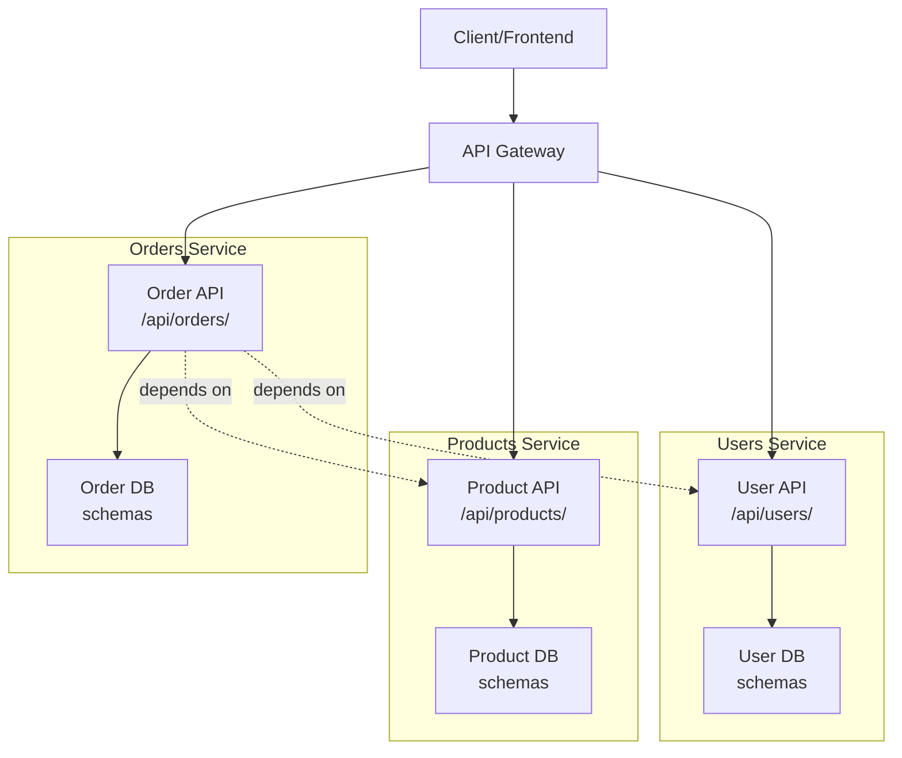
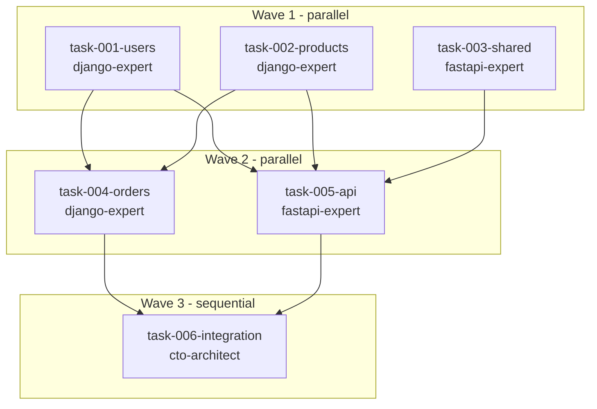
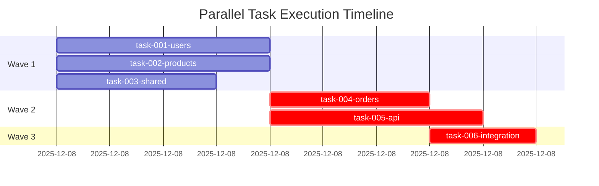

# PRD Decomposition Prompt

Use this prompt when executing `/parallel-decompose`:

---

## Workflow Overview



---

## 1. Determine Output Directory

```bash
PARALLEL_DIR="parallel/TS-0042-inventory-system"
```

**If Tech Spec provided**: Extract ID and slug from Tech Spec file
**If --name provided**: Use `parallel/{slug}/`

## 2. Tech Spec Analysis (if provided)

If a Tech Spec (TS-XXXX) is provided:

1. **Read and validate Tech Spec**:
   - Verify status is APPROVED or REFERENCE
   - Warn if DRAFT (not ready for decomposition)

2. **Extract from Tech Spec**:
   - **Design Overview** → Use for `$PARALLEL_DIR/architecture.md`
   - **Data Model** → Use for `$PARALLEL_DIR/contracts/types.py`
   - **API Specification** → Use for `$PARALLEL_DIR/contracts/api-schema.yaml`
   - **Component boundaries** → Use for task ownership
   - **RFC link** (if any) → Include in task metadata

3. **Skip redundant steps**:
   - If Tech Spec has complete Data Model, skip generating types
   - If Tech Spec has complete API Spec, skip generating api-schema.yaml
   - Focus on task decomposition and boundaries

**If no Tech Spec provided**: Generate contracts from PRD and display warning:
> "Consider creating a Tech Spec first for better contract definitions"

---

## 3. Create manifest.json

Create `$PARALLEL_DIR/manifest.json`:

```json
{
  "version": "1.0.0",
  "created_at": "[current timestamp]",
  "tech_spec": {
    "id": "TS-XXXX",
    "title": "[slug]",
    "path": "[tech spec path]",
    "status": "APPROVED"
  },
  "sources": {
    "prd": "[prd path]",
    "tech_spec": "[tech spec path]"
  },
  "command": {
    "name": "parallel-decompose",
    "args": { ... },
    "invoked_at": "[current timestamp]"
  },
  "technology": "[django|typescript|go]",
  "tasks": { "total": 0, "waves": 0, "files": [] },
  "integration": { "status": "pending" }
}
```

## 4. Create context.md (Shared Project Context)

Create `$PARALLEL_DIR/context.md` with:
- Brief project overview from PRD
- Technology stack
- Project conventions (from CLAUDE.md if exists)
- Key directories
- Contracts location

This file is read once by all agents - keeps token usage low.

## 5. Create Architecture Documentation

Create `$PARALLEL_DIR/architecture.md` with:
- System overview
- **Component diagram** (Mermaid graph showing services, APIs, and dependencies)
- Data flow between components
- Technology choices and rationale
- Component boundaries and ownership (which task owns each component)

**Component Diagram Example**:


**Mermaid conventions**:
- Use `subgraph` to group components by service/task
- Include task number in service label for ownership clarity
- Use solid arrows (`-->`) for direct communication/dependencies
- Use dotted arrows (`-.->`) for weak/indirect dependencies
- Include API endpoints and database schemas for clarity

## 6. Create Contracts

Create contracts in `$PARALLEL_DIR/contracts/`:

### types.py - Shared Domain Types

Domain entities as dataclasses/interfaces for both backend and frontend:

```python
from dataclasses import dataclass
from typing import Optional
from datetime import datetime
from enum import Enum

# Enums
class UserRole(str, Enum):
    ADMIN = "admin"
    USER = "user"
    GUEST = "guest"

class OrderStatus(str, Enum):
    PENDING = "pending"
    CONFIRMED = "confirmed"
    SHIPPED = "shipped"
    DELIVERED = "delivered"
    CANCELLED = "cancelled"

# Domain Models
@dataclass
class User:
    id: int
    email: str
    username: str
    is_active: bool
    role: UserRole
    created_at: datetime
    updated_at: datetime

@dataclass
class Profile:
    user_id: int
    bio: Optional[str] = None
    avatar_url: Optional[str] = None
    updated_at: Optional[datetime] = None

@dataclass
class Product:
    id: int
    name: str
    sku: str
    price: float
    quantity: int
    description: Optional[str] = None
    category: str = "general"
    created_at: datetime = None
    updated_at: datetime = None

# API DTOs (Request/Response)
@dataclass
class UserCreateRequest:
    email: str
    username: str
    password: str

@dataclass
class UserResponse:
    id: int
    email: str
    username: str
    role: UserRole
    profile: Optional[Profile]
    created_at: datetime

@dataclass
class OrderCreateRequest:
    user_id: int
    product_ids: list[int]
    quantity_per_product: dict[int, int]

@dataclass
class OrderResponse:
    id: int
    user_id: int
    status: OrderStatus
    products: list[Product]
    total_amount: float
    created_at: datetime
```

### api-schema.yaml - OpenAPI Specification

Complete API contract for all parallel services:

```yaml
openapi: 3.0.0
info:
  title: Inventory System API
  version: 1.0.0
  description: Multi-service inventory management API

servers:
  - url: /api
    description: API root

components:
  schemas:
    Error:
      type: object
      required: [code, message]
      properties:
        code: {type: string}
        message: {type: string}
        details: {type: object}

    User:
      type: object
      required: [id, email, username, role]
      properties:
        id: {type: integer}
        email: {type: string, format: email}
        username: {type: string, minLength: 3}
        role: {type: string, enum: [admin, user, guest]}
        is_active: {type: boolean}
        profile: {$ref: '#/components/schemas/Profile'}
        created_at: {type: string, format: date-time}
        updated_at: {type: string, format: date-time}

    Profile:
      type: object
      properties:
        user_id: {type: integer}
        bio: {type: string, maxLength: 500}
        avatar_url: {type: string, format: uri}
        updated_at: {type: string, format: date-time}

    Product:
      type: object
      required: [id, name, sku, price, quantity]
      properties:
        id: {type: integer}
        name: {type: string}
        sku: {type: string}
        price: {type: number, minimum: 0}
        quantity: {type: integer, minimum: 0}
        category: {type: string}
        description: {type: string}
        created_at: {type: string, format: date-time}
        updated_at: {type: string, format: date-time}

    Order:
      type: object
      required: [id, user_id, status, products]
      properties:
        id: {type: integer}
        user_id: {type: integer}
        status: {type: string, enum: [pending, confirmed, shipped, delivered, cancelled]}
        products: {type: array, items: {$ref: '#/components/schemas/Product'}}
        total_amount: {type: number, minimum: 0}
        created_at: {type: string, format: date-time}

  securitySchemes:
    bearerAuth:
      type: http
      scheme: bearer
      bearerFormat: JWT

security:
  - bearerAuth: []

paths:
  /users:
    get:
      summary: List all users
      tags: [Users]
      parameters:
        - name: limit
          in: query
          schema: {type: integer, default: 20}
        - name: offset
          in: query
          schema: {type: integer, default: 0}
      responses:
        '200':
          description: Paginated user list
          content:
            application/json:
              schema:
                type: object
                properties:
                  count: {type: integer}
                  results: {type: array, items: {$ref: '#/components/schemas/User'}}
        '401':
          description: Unauthorized
          content:
            application/json:
              schema: {$ref: '#/components/schemas/Error'}

    post:
      summary: Create new user
      tags: [Users]
      security: []
      requestBody:
        required: true
        content:
          application/json:
            schema:
              type: object
              required: [email, username, password]
              properties:
                email: {type: string, format: email}
                username: {type: string, minLength: 3}
                password: {type: string, minLength: 8}
      responses:
        '201':
          description: User created
          content:
            application/json:
              schema: {$ref: '#/components/schemas/User'}
        '400':
          description: Invalid input
          content:
            application/json:
              schema: {$ref: '#/components/schemas/Error'}

  /products:
    get:
      summary: List all products
      tags: [Products]
      responses:
        '200':
          description: Product list
          content:
            application/json:
              schema:
                type: array
                items: {$ref: '#/components/schemas/Product'}

  /orders:
    post:
      summary: Create new order
      tags: [Orders]
      requestBody:
        required: true
        content:
          application/json:
            schema:
              type: object
              required: [product_ids, quantity_per_product]
              properties:
                product_ids: {type: array, items: {type: integer}}
                quantity_per_product: {type: object}
      responses:
        '201':
          description: Order created
          content:
            application/json:
              schema: {$ref: '#/components/schemas/Order'}
        '400':
          description: Invalid input
          content:
            application/json:
              schema: {$ref: '#/components/schemas/Error'}
```

**Key points**:
- All DTOs match the task requirements
- Error responses use consistent schema
- Authentication required for most endpoints (except user creation)
- Complete with field validation (minLength, format, etc.)
- Reusable component definitions for all services

## 7. Task Decomposition (Compact Format)

Create task specs in `$PARALLEL_DIR/tasks/` using compact YAML format:

```yaml
---
id: task-001
component: users
wave: 1
deps: []
blocks: [task-004, task-005]
agent: python-experts:django-expert
tech_spec: TS-0042-inventory-system
contracts: [contracts/types.py, contracts/api-schema.yaml]
---
# task-001: User Authentication & Profiles

## Scope

**CREATE**:
- `apps/users/models.py` - User model with email authentication
- `apps/users/serializers.py` - User and Profile serializers
- `apps/users/views.py` - User list/retrieve/create/update viewsets
- `apps/users/urls.py` - User API routes
- `apps/users/tests/test_models.py` - Model tests
- `apps/users/tests/test_views.py` - API endpoint tests

**MODIFY**:
- `config/urls.py` - Add user API router
- `config/settings.py` - Add users app to INSTALLED_APPS

**BOUNDARY** (Do NOT modify):
- `apps/orders/*` - Order service (task-004 owns)
- `apps/products/*` - Product service (task-005 owns)
- `apps/*/migrations/*` - Do not modify any migrations

## Requirements

- Implement `User` model with fields: `email`, `username`, `password`, `is_active`, `created_at`
- Implement `Profile` model with fields: `user` (FK), `bio`, `avatar_url`, `updated_at`
- Create `UserSerializer` with all User fields (hide password)
- Create `ProfileSerializer` for nested profile in user response
- Implement `UserViewSet` with:
  - `list`: GET /api/users/ - returns paginated users
  - `retrieve`: GET /api/users/{id}/ - returns single user with profile
  - `create`: POST /api/users/ - create new user
  - `update`: PUT /api/users/{id}/ - update user and profile
  - `partial_update`: PATCH /api/users/{id}/ - partial updates
  - Custom `current_user`: GET /api/users/me/ - return authenticated user
- Add email validation and uniqueness constraint
- Add `IsAuthenticated` permission to list/retrieve (anonymous can create)
- Test coverage: minimum 85% for models and views

## Checklist

- [ ] User model matches `User` DTO in contracts/types.py
- [ ] Profile model matches `Profile` DTO in contracts/types.py
- [ ] All API endpoints match schema in contracts/api-schema.yaml
- [ ] Email validation and uniqueness working correctly
- [ ] Authentication permissions enforced
- [ ] `pytest apps/users/ -v` passes all tests
- [ ] `mypy apps/users/ --strict` passes with no errors
- [ ] Coverage report shows ≥85% coverage
- [ ] Code follows Django best practices (models.py, views.py, serializers.py structure)

## Output Format (REQUIRED)

⚠️ **CRITICAL**: You MUST end your response with a JSON summary block.

```json
{
  "task_completed": boolean,
  "validation_passed": boolean,
  "files_created": [string],
  "files_modified": [string],
  "tests_run": integer,
  "tests_passed": integer,
  "tests_failed": integer,
  "summary": string,
  "full_log": string,
  "error_message": string | null
}
```

Set `validation_passed: true` ONLY if all acceptance criteria are met and tests pass.
```

**CRITICAL**: The "## Output Format (REQUIRED)" section MUST be in every task file. The prompt generator extracts this section to include in the final agent prompts. Without it, agents will not know to provide JSON output.

Requirements:
- Each task should be completable in 2-4 hours
- Tasks should touch separate files/directories
- Use compact YAML frontmatter
- Include agent recommendation
- **MUST include "## Output Format (REQUIRED)" section in every task file**

## 8. Create task-graph.md

Create `$PARALLEL_DIR/task-graph.md` with:
- **Mermaid flowchart** for dependency visualization
- **Mermaid Gantt chart** for execution timeline
- Wave summary table
- Critical path
- Parallelization stats

**Mermaid format**:
```markdown
# Task Dependency Graph

## Dependency Visualization



## Wave Summary

| Wave | Tasks | Parallel Agents |
|------|-------|-----------------|
| 1 | task-001, task-002, task-003 | 3 |
| 2 | task-004, task-005 | 2 |
| 3 | task-006 | 1 |

## Wave Execution Order


```

**Mermaid conventions**:
- **Flowchart**: Use `flowchart TB` (top-bottom) for dependencies
  - Group tasks by wave using `subgraph W{N}[Wave N - parallel/sequential]`
  - Node labels: `t{NNN}[task-{NNN}-{component}<br/>{agent}]`
  - Edges: `t001 --> t004` (direct dependency)
- **Gantt chart**: Use task IDs (t001, t002, etc.) as identifiers
  - Parallel Wave 1 tasks start at same date
  - Wave 2+ tasks use `after {taskId}` to show dependencies
  - Critical path tasks (with `crit` keyword) are highlighted
  - Duration estimates are approximate (2-4 hours per task)

## 9. Generate Prompts

Create `$PARALLEL_DIR/prompts/agent-prompts.md` with launch commands.

Create individual `$PARALLEL_DIR/prompts/task-{NNN}.txt` files using this template:

```
TASK-{NNN}: {Title}
Agent: {recommended-agent}
Wave: {N} ({dependency-status})

=== OBJECTIVE ===
{Brief description of what this task accomplishes}

=== CONTEXT ===
{Domain context and background relevant to this task}

Reference: {tech-spec-path} (Section: {relevant-section})
Contracts: {contracts-path}

=== FILES TO CREATE ===
{Numbered list of files to create with descriptions}

=== FILES TO MODIFY ===
{Numbered list of files to modify with descriptions}

=== DO NOT MODIFY ===
{List of files/directories outside this task's scope}

=== IMPLEMENTATION REQUIREMENTS ===
{Detailed requirements extracted from task spec}

=== TEST REQUIREMENTS ===
{List of required tests}

=== ACCEPTANCE CRITERIA ===
{Checklist of completion criteria}

=== EXECUTION INSTRUCTIONS ===

You MUST write code, not just describe it. Follow these steps:

1. **Read first**: Read all referenced files (Tech Spec, Contracts, existing code in scope)
2. **Implement**: Use Write tool to create new files, Edit tool to modify existing files
3. **Test**: Run tests to verify your implementation works
4. **Commit**: Create atomic commits with descriptive messages as you complete each part

=== IMPORTANT RULES ===

- Do NOT ask for confirmation - proceed with implementation immediately
- Do NOT just describe what you would do - actually do it
- Do NOT modify files listed in "DO NOT MODIFY" section
- Do NOT skip writing tests

=== OUTPUT FORMAT (REQUIRED) ===

⚠️ **CRITICAL**: You MUST end your response with a JSON summary block.

```json
{
  "task_completed": boolean,
  "validation_passed": boolean,
  "files_created": [string],
  "files_modified": [string],
  "tests_run": integer,
  "tests_passed": integer,
  "tests_failed": integer,
  "summary": string,
  "full_log": string,
  "error_message": string | null
}
```

Set `validation_passed: true` ONLY if all acceptance criteria are met and tests pass.

COMPLETION SIGNAL:
Upon successful completion (all criteria met, tests passing), run:
  touch .claude-task-complete

This marker signals to the orchestrator that this task is done.
```

**Key elements that MUST be in every prompt**:
- Explicit "You MUST write code" instruction
- Tool names (Write, Edit) called out explicitly
- "Do NOT ask for confirmation" directive
- **OUTPUT FORMAT (REQUIRED) section** with JSON schema
- Completion marker instruction
- Clear boundary enforcement (DO NOT MODIFY section)

---

## 9.1. Prompt Generation: From Task Files to Agent Prompts

**How it works**: The prompt generator (run during decomposition) extracts and transforms sections from task files to create agent-ready prompts.

### Transformation Process

**FROM task file** (markdown format with ## headers):
```markdown
## Scope
CREATE: apps/users/*.py
MODIFY: config/urls.py
BOUNDARY: apps/orders/*

## Requirements
- User model with email authentication
- UserSerializer with explicit fields

## Output Format (REQUIRED)
⚠️ **CRITICAL**: You MUST end your response with a JSON...
```

**TO generated prompt** (section markers with === for visual distinction):
```
=== FILES TO CREATE ===
apps/users/*.py - User models and views

=== FILES TO MODIFY ===
config/urls.py - Add user routes

=== DO NOT MODIFY ===
apps/orders/* - Outside this task's scope

=== IMPLEMENTATION REQUIREMENTS ===
- User model with email authentication
- UserSerializer with explicit fields

=== OUTPUT FORMAT (REQUIRED) ===
⚠️ **CRITICAL**: You MUST end your response with a JSON...
```

**Key mapping**:
| Task File Section | Generated Prompt Section | Transformation |
|---|---|---|
| `## Scope` (CREATE line) | `=== FILES TO CREATE ===` | Parsed into file descriptions |
| `## Scope` (MODIFY line) | `=== FILES TO MODIFY ===` | Parsed into file descriptions |
| `## Scope` (BOUNDARY line) | `=== DO NOT MODIFY ===` | Extracted boundaries |
| `## Requirements` | `=== IMPLEMENTATION REQUIREMENTS ===` | Copied verbatim |
| `## Checklist` | `=== ACCEPTANCE CRITERIA ===` | Converted to checklist format |
| `## Output Format (REQUIRED)` | `=== OUTPUT FORMAT (REQUIRED) ===` | Copied verbatim (CRITICAL) |

**Standard sections added by generator** (always included):
- `=== EXECUTION INSTRUCTIONS ===` - How to approach the task
- `=== IMPORTANT RULES ===` - Do's and don'ts
- `COMPLETION SIGNAL` - File marker to signal completion

### Why the Format Difference?

**Task files use `##` (markdown headers)**: For human readability when viewing task specifications in the tasks/ directory. Markdown headers provide clean, scannable formatting.

**Generated prompts use `===` (section markers)**: Section markers provide clear visual separation in plain text prompts, making it easier for agents to parse and follow the structure. They also distinguish generated prompts from the task source files.

---

## 9.2. agent-prompts.md Template

Create `$PARALLEL_DIR/prompts/agent-prompts.md` with wave summary and launch instructions:

```markdown
# Agent Execution Prompts

**Generated**: [timestamp]
**Source PRD**: [prd-path]
**Source Tech Spec**: [tech-spec-path]
**Technology**: [django|typescript|go]

## How to Execute

Use the `cpo` CLI tool to orchestrate parallel execution:

\`\`\`bash
# Validate manifest structure (no execution)
cpo validate parallel/TS-XXXX-slug/

# Execute all waves (respects dependencies)
cpo run parallel/TS-XXXX-slug/

# Check execution status
cpo status parallel/TS-XXXX-slug/
\`\`\`

## Wave Breakdown

### Wave 1 (Parallel)
Tasks that can run simultaneously - no dependencies

| Task | Agent | Prompt | Description |
|------|-------|--------|-------------|
| task-001-users | python-experts:django-expert | prompts/task-001.txt | User authentication and profiles |
| task-002-products | python-experts:django-expert | prompts/task-002.txt | Product catalog and inventory |

### Wave 2 (Parallel)
Tasks that depend on Wave 1 - can run simultaneously with each other

| Task | Agent | Prompt | Depends On | Description |
|------|-------|--------|-----------|-------------|
| task-003-orders | python-experts:django-expert | prompts/task-003.txt | task-001, task-002 | Order creation and management |

### Wave 3 (Sequential)
Integration and final steps - runs after all prior waves

| Task | Agent | Prompt | Depends On | Description |
|------|-------|--------|-----------|-------------|
| task-004-integration | devops-data:cto-architect | prompts/task-004.txt | task-003 | Integration tests and cleanup |

## Execution Workflow

1. **Validate**: `cpo validate` ensures manifest and prompts are well-formed
2. **Execute**: `cpo run` creates git worktrees and launches agents
3. **Monitor**: Live output shows progress for each task
4. **Collect**: Results written to `logs/` and `report.json`
5. **Integrate**: Run `/parallel-integrate` to merge and validate

## Agent Isolation

Each task runs in its own git worktree, isolated from others. This ensures:
- No file conflicts between parallel tasks
- Clean, independent git history per task
- Easy rollback if any task fails

## Next Steps

After all agents complete:

\`\`\`bash
# Verify contract compliance, test all tests
/parallel-integrate --parallel-dir parallel/TS-XXXX-slug/

# Review results
cat parallel/TS-XXXX-slug/integration-report.md
\`\`\`
```

---

## 10. Update Manifest & Report Results

After generating all artifacts, update `manifest.json` with final task counts and report completion status.

---

## 11. Expected Output Summary

After decomposition, provide:
- Output directory: `parallel/TS-XXXX-slug/`
- Source PRD file
- Source Tech Spec file (if provided)
- Total tasks created
- Wave count
- Maximum parallelization per wave
- Critical path

---

## 12. Example Output Structure

```
parallel/TS-0042-inventory-system/
├── manifest.json
├── context.md
├── architecture.md
├── task-graph.md
├── contracts/
│   ├── types.py
│   └── api-schema.yaml
├── tasks/
│   ├── task-001-users.md
│   ├── task-002-products.md
│   ├── task-003-orders.md
│   └── task-004-api.md
└── prompts/
    ├── agent-prompts.md
    ├── task-001.txt
    └── task-002.txt
```

## Summary Format

```
Decomposition Complete

Output: parallel/TS-0042-inventory-system/
Source: docs/inventory-prd.md
Tech Spec: TS-0042

Tasks: 6
Waves: 3
Max parallel: 3

Next: Review tasks, then run cpo run [THE TASKS FOLDER] to execute the work.
```

---

## 13. Validation Rules for Complete Decompositions

Before finalizing the decomposition, verify these criteria:

### Dependency & Wave Structure

- [ ] **No circular dependencies**: No task blocks itself or creates cycles
- [ ] **Wave ordering valid**: Each task's dependencies are in earlier waves
- [ ] **Critical path reasonable**: Longest dependency chain is ≤4 waves (each ~4 hours max)
- [ ] **Parallelization utilized**: Wave 1 has ≥2 parallel tasks (otherwise single-threaded execution)

### Task Granularity & Scope

- [ ] **2-4 hour granularity**: Each task is sized for 2-4 hour completion (not 30 min, not 2 days)
- [ ] **File independence**: Tasks touch separate files/directories (minimal overlap)
- [ ] **Clear boundaries**: BOUNDARY section lists all off-limits files/directories
- [ ] **Output Format present**: Every task file contains `## Output Format (REQUIRED)` section
- [ ] **Agent assignment**: Every task has a recommended agent (django-expert, fastapi-expert, etc.)

### Contracts & Interfaces

- [ ] **Complete types.py**: All domain entities defined with all required fields
- [ ] **Complete api-schema.yaml**: All endpoints documented with request/response schemas
- [ ] **Contract coverage**: Every task references contracts in frontmatter
- [ ] **No contract duplication**: Types are defined once, not repeated across tasks

### Documentation

- [ ] **Scope clarity**: CREATE/MODIFY/BOUNDARY sections are explicit and precise
- [ ] **Requirements realistic**: Requirements match task granularity (2-4 hours)
- [ ] **Checklist completeness**: Checklist covers all acceptance criteria from requirements
- [ ] **Architecture diagram**: architecture.md includes Mermaid component diagram with task ownership
- [ ] **Task graph**: task-graph.md includes Mermaid flowchart and Gantt chart

### Output Format

Before executing agents, verify **every** task file has:
```markdown
## Output Format (REQUIRED)

⚠️ **CRITICAL**: You MUST end your response with a JSON summary block.

```json
{
  "task_completed": boolean,
  "validation_passed": boolean,
  "files_created": [string],
  "files_modified": [string],
  "tests_run": integer,
  "tests_passed": integer,
  "tests_failed": integer,
  "summary": string,
  "full_log": string,
  "error_message": string | null
}
```

Set `validation_passed: true` ONLY if all acceptance criteria are met and tests pass.
```

**This section is extracted by the prompt generator** - without it, agents won't know the expected output format.

---

## 14. Troubleshooting & Common Issues

### Issue: Task Dependencies Are Circular

**Symptoms**: cpo validate reports "circular dependency detected" or task A depends on B depends on C depends on A.

**Solutions**:
1. **Review task boundaries**: One task may be trying to do too much. Split it into subtasks.
2. **Create a shared/integration task**: If two services need each other, create an intermediate task that both depend on.
3. **Reorder waves**: Some "dependencies" might be ordering preference, not true dependencies.
4. **Merge tasks**: If tasks are highly coupled, consider merging them into a single wave.

**Example**:
```
Before (circular):
task-001-users --> task-002-orders --> task-003-products --> task-001-users (CIRCULAR!)

After (fixed):
Wave 1 (parallel):
- task-001-shared-models (dataclasses, enums)
- task-002-users (depends on task-001)
- task-003-products (depends on task-001)
Wave 2 (parallel):
- task-004-orders (depends on task-002, task-003)
```

### Issue: Task Is Too Large (>4 Hours)

**Symptoms**: Task requirements span multiple features or 200+ lines of code

**Solutions**:
1. **Split by component**: Create separate tasks for models, views, tests
2. **Create intermediate task**: Add a "shared setup" task that other tasks depend on
3. **Defer optional features**: Move nice-to-have features to a follow-up task
4. **Increase wave count**: It's okay to have more waves if it keeps tasks focused

**Example**:
```
Before (oversized - 6+ hours):
- task-001: Implement user model, views, serializers, tests, auth permissions

After (rightsize - 2-3 hours each):
Wave 1: task-001 - User models and database schema
Wave 2: task-002 - User API views and serializers (depends on task-001)
Wave 3: task-003 - Auth permissions and middleware (depends on task-002)
```

### Issue: Tech Spec Is Incomplete or DRAFT

**Symptoms**: Tech Spec status is DRAFT or missing Design Overview/API Specification

**Solutions**:
1. **Warn but proceed**: Display warning message suggesting user complete Tech Spec first
2. **Generate best-effort contracts**: Create types.py and api-schema.yaml based on PRD with TODO comments
3. **Add tech spec reference**: Include path in manifest.json even if incomplete
4. **Document assumptions**: In context.md, list any assumptions made due to incomplete Tech Spec
5. **Flag for re-decomposition**: Note that decomposition should be re-run after Tech Spec is approved

**Example warning**:
```
⚠️  WARNING: Tech Spec TS-0042 is in DRAFT status.
    Consider completing the Tech Spec before proceeding with agent execution.
    Tasks may need re-decomposition if Tech Spec design changes significantly.
```

### Issue: Agent Recommendations Are Unclear

**Symptoms**: Not sure which agent type (django-expert, fastapi-expert, etc.) should own a task

**Solutions**:
1. **Match technology stack**: Use django-expert for Django tasks, fastapi-expert for FastAPI
2. **Consider task complexity**: cto-architect for integration/architectural tasks
3. **Look at file ownership**: If task modifies multiple apps, cto-architect might be better
4. **Check agent capabilities**: Use agent's specialty (react-typescript-expert for UI, etc.)
5. **One agent per task**: Avoid assigning multiple agents to same task (simplifies orchestration)

**Common patterns**:
- Models/Serializers → python-experts:django-expert
- API Views → python-experts:django-expert or python-experts:fastapi-expert
- Frontend Components → frontend-experts:react-typescript-expert
- Integration/Refactoring → devops-data:cto-architect
- Configuration/CI → devops-data:devops-expert

### Issue: Contract-Task Mismatch

**Symptoms**: Generated prompts show API endpoints that don't match contracts/api-schema.yaml

**Solutions**:
1. **Update contracts first**: Modify contracts/ files before task decomposition
2. **Validate against schema**: Use OpenAPI validator to check task requirements match schema
3. **Add inline schema mapping**: In Requirements section, reference specific schema sections
4. **Regenerate prompts**: After updating contracts, regenerate prompts for affected tasks

**Example**:
```markdown
## Requirements

- Implement User GET endpoint that matches schema: contracts/api-schema.yaml#/paths/~1users~1{id}
- Response must include nested Profile object per: contracts/api-schema.yaml#/components/schemas/User/properties/profile
```

### Issue: Test Requirements Missing

**Symptoms**: Tasks don't specify how to test, or test coverage expectations are vague

**Solutions**:
1. **Add pytest/test patterns**: Specify test file paths (apps/users/tests/test_models.py)
2. **Set coverage threshold**: Require minimum coverage (e.g., "pytest --cov=apps/users --cov-fail-under=85")
3. **List required test types**: Unit tests, integration tests, API endpoint tests
4. **Reference fixtures**: Point to shared fixtures in contracts if any exist

**Example**:

```markdown
## Checklist

- [ ] `pytest apps/users/tests/test_models.py -v` passes all tests
- [ ] `pytest apps/users/ --cov=apps.users --cov-fail-under=85` meets coverage target
- [ ] No mypy errors: `mypy apps/users/ --strict`
```

---

## 15. Common Decomposition Patterns

Proven patterns for common architectural scenarios:

### Pattern: Microservices Architecture

Use this pattern when decomposing a system into independent services:

```
Wave 1 (Parallel - Shared Foundation):
- task-001-shared-models
  - Scope: contracts/ (types.py, api-schema.yaml, enums)
  - Owner: CTO architect

Wave 2 (Parallel - Service Implementations):
- task-002-users-service
  - Scope: apps/users/* (models, views, serializers, tests)
  - Depends on: task-001

- task-003-products-service
  - Scope: apps/products/* (models, views, serializers, tests)
  - Depends on: task-001

- task-004-orders-service
  - Scope: apps/orders/* (models, views, serializers, tests)
  - Depends on: task-001

Wave 3 (Parallel - API Gateway & Routing):
- task-005-api-gateway
  - Scope: config/urls.py, api/router.py (route all services)
  - Depends on: task-002, task-003, task-004

Wave 4 (Sequential - Integration):
- task-006-integration-tests
  - Scope: tests/integration/* (test service communication)
  - Depends on: task-005
```

**Advantages**: Clean service boundaries, maximum parallelization, easy testing

### Pattern: Feature With Database Migrations (Django)

Use this pattern for features requiring database schema changes:

```
Wave 1 (Sequential - Models First):
- task-001-models-and-migrations
  - Scope: apps/inventory/models.py, apps/inventory/migrations/*.py
  - Checklist: migrations created and tested

Wave 2 (Parallel - Views & Business Logic):
- task-002-views-and-serializers
  - Scope: apps/inventory/views.py, serializers.py
  - Depends on: task-001
  - Note: Cannot run until task-001 migrations are applied

- task-003-api-endpoints
  - Scope: apps/inventory/urls.py, api/routes.py
  - Depends on: task-001

Wave 3 (Sequential - Tests & Validation):
- task-004-comprehensive-tests
  - Scope: apps/inventory/tests/*.py
  - Depends on: task-002, task-003
  - Checklist: All database operations tested
```

**Why this order**: Django migrations are sequential. Models must exist before serializers can be tested.

### Pattern: Frontend Feature (React/TypeScript)

Use this pattern for UI feature decomposition:

```
Wave 1 (Parallel - Design System & Hooks):
- task-001-ui-types-and-hooks
  - Scope: src/types/feature.ts, src/hooks/useFeature.ts
  - Owner: frontend-experts:react-typescript-expert

Wave 2 (Parallel - Components):
- task-002-form-components
  - Scope: src/components/FeatureForm/
  - Depends on: task-001

- task-003-list-components
  - Scope: src/components/FeatureList/
  - Depends on: task-001

Wave 3 (Parallel - Pages):
- task-004-feature-page
  - Scope: src/pages/Feature/
  - Depends on: task-002, task-003

- task-005-admin-panel
  - Scope: src/pages/Admin/Feature/
  - Depends on: task-002, task-003

Wave 4 (Sequential - Integration):
- task-006-routing-and-integration
  - Scope: src/routes.ts, src/layouts/
  - Depends on: task-004, task-005
```

**Advantages**: Types shared first, parallel component development, clean layer separation

### Pattern: Monolith Refactoring

Use this pattern when extracting functionality from a monolith:

```
Wave 1 (Sequential - Interface Definition):
- task-001-extract-interfaces
  - Scope: Extract public contracts from existing code
  - Checklist: Interfaces match existing API behavior

Wave 2 (Parallel - New Implementation):
- task-002-users-extraction
  - Scope: Create apps/users/ based on extracted interfaces
  - Depends on: task-001

- task-003-products-extraction
  - Scope: Create apps/products/ based on extracted interfaces
  - Depends on: task-001

- task-004-orders-extraction
  - Scope: Create apps/orders/ based on extracted interfaces
  - Depends on: task-001

Wave 3 (Sequential - Gradual Cutover):
- task-005-routing-migration
  - Scope: Route requests to new services
  - Depends on: task-002, task-003, task-004
  - Checklist: All routes tested with new services

Wave 4 (Sequential - Cleanup):
- task-006-remove-old-code
  - Scope: Delete extracted code from monolith
  - Depends on: task-005
  - Note: AFTER cutover is verified in production
```

**Key insight**: Extract interfaces first, implement in parallel, migrate routing last

### Pattern: Data Pipeline (ETL)

Use this pattern for data transformation workflows:

```
Wave 1 (Parallel - Source Connectors):
- task-001-database-connector
  - Scope: Extract from database source

- task-002-csv-connector
  - Scope: Extract from CSV files

- task-003-api-connector
  - Scope: Extract from external API

Wave 2 (Parallel - Data Validation):
- task-004-database-validator
  - Scope: Validate database records
  - Depends on: task-001

- task-005-csv-validator
  - Scope: Validate CSV fields
  - Depends on: task-002

- task-006-api-validator
  - Scope: Validate API responses
  - Depends on: task-003

Wave 3 (Sequential - Transform & Load):
- task-007-unified-transform
  - Scope: Transform all validated data to common schema
  - Depends on: task-004, task-005, task-006

- task-008-data-warehouse-load
  - Scope: Load transformed data to warehouse
  - Depends on: task-007

Wave 4 (Sequential - Reporting):
- task-009-generate-reports
  - Scope: Create reports from loaded data
  - Depends on: task-008
```

**Key insight**: Extract in parallel, validate in parallel, transform/load sequentially

### How to Apply Patterns

1. **Select the closest match** to your use case
2. **Adapt wave structure** - add/remove tasks as needed
3. **Update dependencies** - adjust to your actual dependencies
4. **Assign agents** - use agent expertise for each task
5. **Define contracts** - start with types.py and api-schema.yaml
6. **Detail requirements** - expand task requirements from pattern
7. **Validate** - run through Section 13 validation checklist
