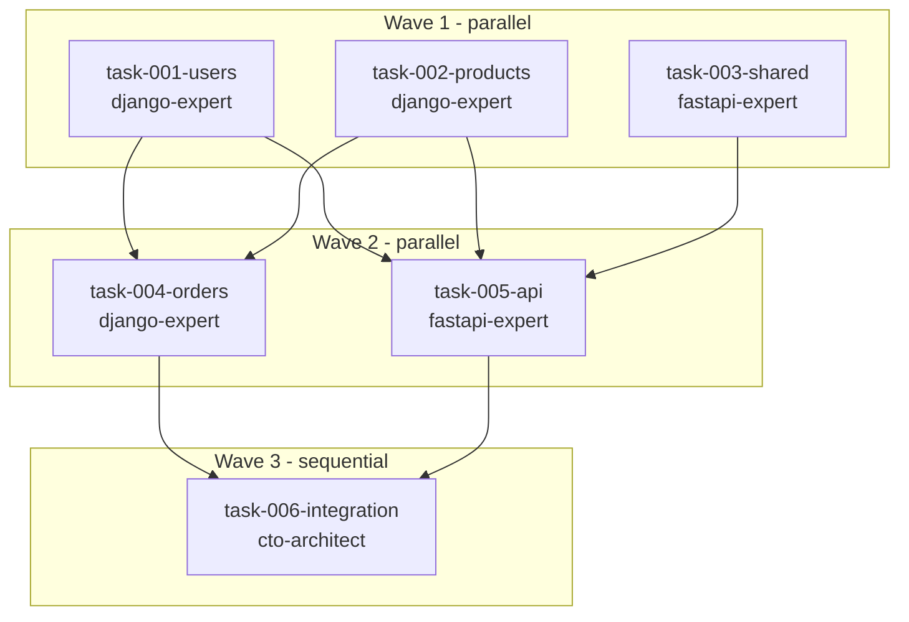

# PRD Decomposition Prompt

Use this prompt when executing `/parallel-decompose`:

---

## 0. Determine Output Directory

```bash
PARALLEL_DIR="parallel/TS-0042-inventory-system"
```

**If Tech Spec provided**: Extract ID and slug from Tech Spec file
**If --name provided**: Use `parallel/{slug}/`

## 1. Tech Spec Analysis (if provided)

If a Tech Spec (TS-XXXX) is provided:

1. **Read and validate Tech Spec**:
   - Verify status is APPROVED or REFERENCE
   - Warn if DRAFT (not ready for decomposition)

2. **Extract from Tech Spec**:
   - **Design Overview** → Use for `$PARALLEL_DIR/architecture.md`
   - **Data Model** → Use for `$PARALLEL_DIR/contracts/types.py`
   - **API Specification** → Use for `$PARALLEL_DIR/contracts/api-schema.yaml`
   - **Component boundaries** → Use for task ownership
   - **RFC link** (if any) → Include in task metadata

3. **Skip redundant steps**:
   - If Tech Spec has complete Data Model, skip generating types
   - If Tech Spec has complete API Spec, skip generating api-schema.yaml
   - Focus on task decomposition and boundaries

**If no Tech Spec provided**: Generate contracts from PRD and display warning:
> "Consider creating a Tech Spec first for better contract definitions"

---

## 2. Create manifest.json

Create `$PARALLEL_DIR/manifest.json`:

```json
{
  "version": "1.0.0",
  "created_at": "[current timestamp]",
  "tech_spec": {
    "id": "TS-XXXX",
    "title": "[slug]",
    "path": "[tech spec path]",
    "status": "APPROVED"
  },
  "sources": {
    "prd": "[prd path]",
    "tech_spec": "[tech spec path]"
  },
  "command": {
    "name": "parallel-decompose",
    "args": { ... },
    "invoked_at": "[current timestamp]"
  },
  "technology": "[django|typescript|go]",
  "tasks": { "total": 0, "waves": 0, "files": [] },
  "integration": { "status": "pending" }
}
```

## 3. Create context.md (Shared Project Context)

Create `$PARALLEL_DIR/context.md` with:
- Brief project overview from PRD
- Technology stack
- Project conventions (from CLAUDE.md if exists)
- Key directories
- Contracts location

This file is read once by all agents - keeps token usage low.

## 4. Create Architecture Documentation

Create `$PARALLEL_DIR/architecture.md` with:
- System overview and component diagram (ASCII or Mermaid)
- Data flow between components
- Technology choices and rationale
- Component boundaries and ownership

## 5. Create Contracts

Create contracts in `$PARALLEL_DIR/contracts/`:

**types.py** (or types.ts) - Shared types:
- Domain entities as dataclasses/interfaces
- API request/response types
- Shared enums and constants

**api-schema.yaml** - OpenAPI specification:
- All endpoints with full schemas
- Error response formats
- Authentication requirements

## 6. Task Decomposition (Compact Format)

Create task specs in `$PARALLEL_DIR/tasks/` using compact YAML format:

```yaml
---
id: task-001
component: users
wave: 1
deps: []
blocks: [task-004]
agent: django-expert
tech_spec: TS-XXXX
contracts: [contracts/types.py, contracts/api-schema.yaml]
---
# task-001: User Management

## Scope
CREATE: apps/users/*.py
MODIFY: config/urls.py
BOUNDARY: apps/orders/*, apps/products/*

## Requirements
- [Bullet list of requirements]

## Checklist
- [ ] [Verification items]
```

Requirements:
- Each task should be completable in 2-4 hours
- Tasks should touch separate files/directories
- Use compact YAML frontmatter
- Include agent recommendation

## 7. Create task-graph.md

Create `$PARALLEL_DIR/task-graph.md` with:
- **Mermaid flowchart** for dependency visualization
- Wave summary table
- Critical path
- Parallelization stats

**Mermaid format**:
```markdown
# Task Dependency Graph

## Dependency Visualization



## Wave Summary
...
```

**Mermaid conventions**:
- Use `flowchart TB` (top-bottom) for wave hierarchy
- Group tasks by wave using `subgraph W{N}[Wave N - parallel/sequential]`
- Node labels: `t{NNN}[task-{NNN}-{component}<br/>{agent}]`
- Edges: `t001 --> t004` (direct dependency)

## 8. Generate Prompts

Create `$PARALLEL_DIR/prompts/agent-prompts.md` with launch commands.

Create individual `$PARALLEL_DIR/prompts/task-{NNN}.txt` files:
```
Execute task from parallel/TS-XXXX-slug/tasks/task-001.md.
Read context from parallel/TS-XXXX-slug/context.md first.
Read contracts from parallel/TS-XXXX-slug/contracts/ before implementing.
Follow the Scope, Requirements, and Checklist in the task file.
Do not modify files outside the defined Scope.
```

## 9. Generate Scripts

Create `$PARALLEL_DIR/scripts/`:
- `launch-wave-1.sh` - Setup worktrees and launch Wave 1
- `launch-wave-2.sh` - Launch Wave 2 after Wave 1 completes
- `monitor.sh` - Check task branch status

## 10. Update manifest.json

Update task counts:
```json
{
  "tasks": {
    "total": 6,
    "waves": 3,
    "files": ["tasks/task-001-users.md", ...]
  }
}
```

---

## Expected Output Summary

After decomposition, provide:
- Output directory: `parallel/TS-XXXX-slug/`
- Source PRD file
- Source Tech Spec file (if provided)
- Total tasks created
- Wave count
- Maximum parallelization per wave
- Critical path

---

## Example Output Structure

```
parallel/TS-0042-inventory-system/
├── manifest.json
├── context.md
├── architecture.md
├── task-graph.md
├── contracts/
│   ├── types.py
│   └── api-schema.yaml
├── tasks/
│   ├── task-001-users.md
│   ├── task-002-products.md
│   ├── task-003-orders.md
│   └── task-004-api.md
├── prompts/
│   ├── agent-prompts.md
│   ├── task-001.txt
│   └── task-002.txt
└── scripts/
    ├── launch-wave-1.sh
    └── monitor.sh
```

## Summary Format

```
Decomposition Complete

Output: parallel/TS-0042-inventory-system/
Source: docs/inventory-prd.md
Tech Spec: TS-0042

Tasks: 6
Waves: 3
Max parallel: 3

Next: Review tasks, then run scripts/launch-wave-1.sh
```
