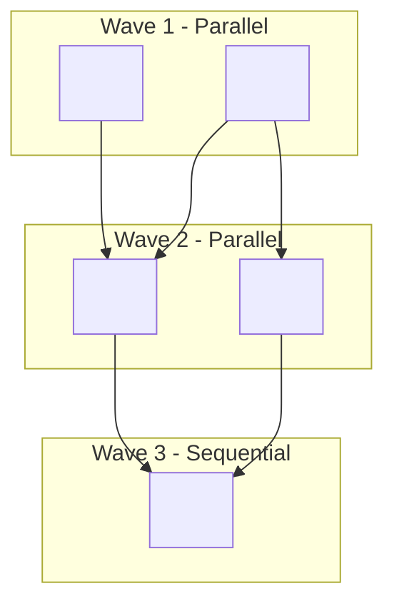
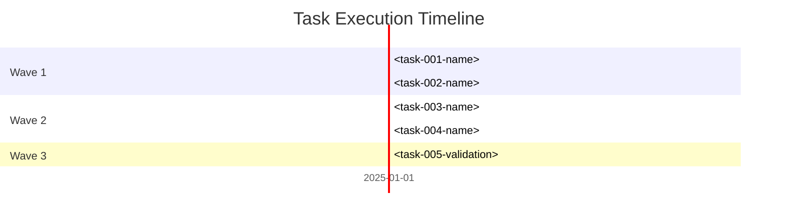

# Plan With Team

Create a detailed implementation plan based on the user's requirements provided through the `USER_PROMPT` variable. Analyze the request, think through the implementation approach, and save a comprehensive specification document to `PLAN_OUTPUT_DIRECTORY/<name-of-plan>.md` that can be used as a blueprint for actual development work. Follow the `Instructions` and work through the `Workflow` to create the plan.

## Variables

USER_PROMPT: $1
ORCHESTRATION_PROMPT: $2 - (Optional) Guidance for team assembly, task structure, and execution strategy
PLAN_OUTPUT_DIRECTORY: `specs/`
TEAM_MEMBERS: `.claude/agents/team/*.md`
GENERAL_PURPOSE_AGENT: `general-purpose`

## Instructions

- **PLANNING ONLY**: Do NOT build, write code, or deploy agents. Your only output is a plan document saved to `PLAN_OUTPUT_DIRECTORY`.
- If no `USER_PROMPT` is provided, stop and ask the user to provide it.
- If `ORCHESTRATION_PROMPT` is provided, use it to guide team composition, task granularity, dependency structure, and parallel/sequential decisions.
- Carefully analyze the user's requirements provided in the USER_PROMPT variable
- Determine the task type (chore|feature|refactor|fix|enhancement) and complexity (simple|medium|complex)
- Think deeply (ultrathink) about the best approach to implement the requested functionality or solve the problem
- Understand the codebase directly without subagents to understand existing patterns and architecture
- Follow the Plan Format below to create a comprehensive implementation plan
- Include all required sections and conditional sections based on task type and complexity
- Generate a descriptive, kebab-case filename based on the main topic of the plan
- Save the complete implementation plan to `PLAN_OUTPUT_DIRECTORY/<descriptive-name>.md`
- Ensure the plan is detailed enough that another developer could follow it to implement the solution
- Include code examples or pseudo-code where appropriate to clarify complex concepts
- Consider edge cases, error handling, and scalability concerns
- Understand your role as the team lead. Refer to the `Team Orchestration` section for more details.

### Team Orchestration

As the team lead, you have access to powerful tools for coordinating work across multiple agents. You NEVER write code directly - you orchestrate team members using these tools.

#### Task Management Tools

**TaskCreate** - Create tasks in the shared task list:
```typescript
TaskCreate({
  subject: "Implement user authentication",
  description: "Create login/logout endpoints with JWT tokens. See specs/auth-plan.md for details.",
  activeForm: "Implementing authentication"  // Shows in UI spinner when in_progress
})
// Returns: taskId (e.g., "1")
```

**TaskUpdate** - Update task status, assignment, or dependencies:
```typescript
TaskUpdate({
  taskId: "1",
  status: "in_progress",  // pending → in_progress → completed
  owner: "builder-auth"   // Assign to specific team member
})
```

**TaskList** - View all tasks and their status:
```typescript
TaskList({})
// Returns: Array of tasks with id, subject, status, owner, blockedBy
```

**TaskGet** - Get full details of a specific task:
```typescript
TaskGet({ taskId: "1" })
// Returns: Full task including description
```

#### Task Dependencies

Use `addBlockedBy` to create sequential dependencies - blocked tasks cannot start until dependencies complete:

```typescript
// Task 2 depends on Task 1
TaskUpdate({
  taskId: "2",
  addBlockedBy: ["1"]  // Task 2 blocked until Task 1 completes
})

// Task 3 depends on both Task 1 and Task 2
TaskUpdate({
  taskId: "3",
  addBlockedBy: ["1", "2"]
})
```

Dependency chain example:
```
Task 1: Setup foundation     → no dependencies
Task 2: Implement feature    → blockedBy: ["1"]
Task 3: Write tests          → blockedBy: ["2"]
Task 4: Final validation     → blockedBy: ["1", "2", "3"]
```

#### Owner Assignment

Assign tasks to specific team members for clear accountability:

```typescript
// Assign task to a specific builder
TaskUpdate({
  taskId: "1",
  owner: "builder-api"
})

// Team members check for their assignments
TaskList({})  // Filter by owner to find assigned work
```

#### Agent Deployment with Task Tool

**Task** - Deploy an agent to do work:
```typescript
Task({
  description: "Implement auth endpoints",
  prompt: "Implement the authentication endpoints as specified in Task 1...",
  subagent_type: "general-purpose",
  model: "opus",  // or "opus" for complex work, "haiku" for VERY simple
  run_in_background: false  // true for parallel execution
})
// Returns: agentId (e.g., "a1b2c3")
```

#### Resume Pattern

Store the agentId to continue an agent's work with preserved context:

```typescript
// First deployment - agent works on initial task
Task({
  description: "Build user service",
  prompt: "Create the user service with CRUD operations...",
  subagent_type: "general-purpose"
})
// Returns: agentId: "abc123"

// Later - resume SAME agent with full context preserved
Task({
  description: "Continue user service",
  prompt: "Now add input validation to the endpoints you created...",
  subagent_type: "general-purpose",
  resume: "abc123"  // Continues with previous context
})
```

When to resume vs start fresh:
- **Resume**: Continuing related work, agent needs prior context
- **Fresh**: Unrelated task, clean slate preferred

#### Parallel Execution

Run multiple agents simultaneously with `run_in_background: true`:

```typescript
// Launch multiple agents in parallel
Task({
  description: "Build API endpoints",
  prompt: "...",
  subagent_type: "general-purpose",
  run_in_background: true
})
// Returns immediately with agentId and output_file path

Task({
  description: "Build frontend components",
  prompt: "...",
  subagent_type: "general-purpose",
  run_in_background: true
})
// Both agents now working simultaneously

// Check on progress
TaskOutput({
  task_id: "agentId",
  block: false,  // non-blocking check
  timeout: 5000
})

// Wait for completion
TaskOutput({
  task_id: "agentId",
  block: true,  // blocks until done
  timeout: 300000
})
```

#### Orchestration Workflow

1. **Create tasks** with `TaskCreate` for each step in the plan
2. **Set dependencies** with `TaskUpdate` + `addBlockedBy`
3. **Assign owners** with `TaskUpdate` + `owner`
4. **Deploy agents** with `Task` to execute assigned work
5. **Monitor progress** with `TaskList` and `TaskOutput`
6. **Resume agents** with `Task` + `resume` for follow-up work
7. **Mark complete** with `TaskUpdate` + `status: "completed"`

## Workflow

IMPORTANT: **PLANNING ONLY** - Do not execute, build, or deploy. Output is a plan document.

1. Analyze Requirements - Parse the USER_PROMPT to understand the core problem and desired outcome
2. Understand Codebase - Without subagents, directly understand existing patterns, architecture, and relevant files
3. Generate Contracts (if needed) - If task involves multiple parallel agents or API boundaries, create shared contracts:
   - `contracts/types.py` - Shared data structures, enums, type aliases for cross-agent consistency
   - `contracts/api-schema.yaml` - OpenAPI specification for API endpoints and request/response schemas
   - Skip if contracts already exist or task is purely sequential with no API boundaries
4. Analyze File Ownership - For each task, determine file ownership to prevent merge conflicts in parallel execution:
   - **CREATE**: Files this task will create (exclusive to one task across all waves)
   - **MODIFY**: Files this task will modify, with scoped changes specified (e.g., `file.py::function_name`, `file.py::ClassName.method`)
   - **BOUNDARY**: Files this task must NOT touch (owned by other tasks)
   - Build File Ownership Matrix to validate no conflicts exist in parallel tasks (same wave)
5. Design Solution - Develop technical approach including architecture decisions and implementation strategy
6. Define Team Members - Use `ORCHESTRATION_PROMPT` (if provided) to guide team composition. Identify from `.claude/agents/team/*.md` or use `general-purpose`. Document in plan.
7. Define Step by Step Tasks - Use `ORCHESTRATION_PROMPT` (if provided) to guide task granularity and parallel/sequential structure. Write out tasks with IDs, dependencies, assignments. Document in plan.
8. Organize into Waves - Group tasks by dependency depth for parallel execution:
   - **Wave 1**: Tasks with no dependencies (can run immediately in parallel)
   - **Wave 2**: Tasks that depend only on Wave 1 (run after Wave 1 completes)
   - **Wave N**: Tasks that depend on previous waves (run sequentially by wave)
   - Number waves sequentially (1, 2, 3...), ensuring all task dependencies are satisfied before wave assignment
9. Generate Dependency Graph - Create Mermaid flowchart showing task relationships and execution flow:
   - Use `subgraph` to visually group tasks by wave number
   - Show task dependencies with arrows (`-->`) connecting dependent tasks
   - Include agent assignments in task node labels for clarity
   - Optionally add Gantt chart for timeline visualization (if complex project with multiple waves)
10. Generate Filename - Create a descriptive kebab-case filename based on the plan's main topic
11. Save Plan - Write the plan to `PLAN_OUTPUT_DIRECTORY/<filename>.md`
12. Save & Report - Follow the `Report` section to write the plan to `PLAN_OUTPUT_DIRECTORY/<filename>.md` and provide a summary of key components

## Plan Format

- IMPORTANT: Replace <requested content> with the requested content. It's been templated for you to replace. Consider it a micro prompt to replace the requested content.
- IMPORTANT: Anything that's NOT in <requested content> should be written EXACTLY as it appears in the format below.
- IMPORTANT: Follow this EXACT format when creating implementation plans:

```md
# Plan: <task name>

## Task Description
<describe the task in detail based on the prompt>

## Objective
<clearly state what will be accomplished when this plan is complete>

<if task_type is feature or complexity is medium/complex, include these sections:>
## Problem Statement
<clearly define the specific problem or opportunity this task addresses>

## Solution Approach
<describe the proposed solution approach and how it addresses the objective>
</if>

## Relevant Files
Use these files to complete the task:

<list files relevant to the task with bullet points explaining why. Include new files to be created under an h3 'New Files' section if needed>

<if task involves multi-agent coordination or API boundaries, include this section:>
## Contracts

When multiple agents work in parallel or integrate across API boundaries, shared contracts ensure consistency.

### Shared Types (contracts/types.py)

```python
from dataclasses import dataclass
from typing import Optional
from datetime import datetime
from enum import Enum

class <EntityName>Status(str, Enum):
    <STATUS_1> = "status_1"
    <STATUS_2> = "status_2"

@dataclass
class <EntityName>:
    id: int
    name: str
    status: <EntityName>Status
    created_at: datetime

@dataclass
class <EntityName>CreateRequest:
    name: str
    <additional fields>
```

### API Schema (contracts/api-schema.yaml)

```yaml
openapi: 3.0.0
info:
  title: <API Name>
  version: 1.0.0

components:
  schemas:
    <EntityName>:
      type: object
      required: [id, name]
      properties:
        id: {type: integer}
        name: {type: string}
        status: {type: string, enum: [status_1, status_2]}

paths:
  /<resource>:
    get:
      summary: List <resources>
      responses:
        '200':
          description: <Resource> list
          content:
            application/json:
              schema:
                type: array
                items:
                  $ref: '#/components/schemas/<EntityName>'
    post:
      summary: Create <resource>
      requestBody:
        required: true
        content:
          application/json:
            schema:
              $ref: '#/components/schemas/<EntityName>CreateRequest'
      responses:
        '201':
          description: Created
```
</if>

<if complexity is medium/complex, include this section:>
## Implementation Phases
### Phase 1: Foundation
<describe any foundational work needed>

### Phase 2: Core Implementation
<describe the main implementation work>

### Phase 3: Integration & Polish
<describe integration, testing, and final touches>
</if>

## Team Orchestration

- You operate as the team lead and orchestrate the team to execute the plan.
- You're responsible for deploying the right team members with the right context to execute the plan.
- IMPORTANT: You NEVER operate directly on the codebase. You use `Task` and `Task*` tools to deploy team members to to the building, validating, testing, deploying, and other tasks.
  - This is critical. You're job is to act as a high level director of the team, not a builder.
  - You're role is to validate all work is going well and make sure the team is on track to complete the plan.
  - You'll orchestrate this by using the Task* Tools to manage coordination between the team members.
  - Communication is paramount. You'll use the Task* Tools to communicate with the team members and ensure they're on track to complete the plan.
- Take note of the session id of each team member. This is how you'll reference them.

### Team Members
<list the team members you'll use to execute the plan>

- Builder
  - Name: <unique name for this builder - this allows you and other team members to reference THIS builder by name. Take note there may be multiple builders, the name make them unique.>
  - Role: <the single role and focus of this builder will play>
  - Agent Type: <the subagent type of this builder, you'll specify based on the name in TEAM_MEMBERS file or GENERAL_PURPOSE_AGENT if you want to use a general-purpose agent>
  - Resume: <default true. This lets the agent continue working with the same context. Pass false if you want to start fresh with a new context.>
- <continue with additional team members as needed in the same format as above>

### File Ownership Matrix

Track which tasks create or modify which files to prevent merge conflicts in parallel execution.

| File | CREATE | MODIFY Scope | Task ID | Wave |
|------|--------|--------------|---------|------|
| `<path/to/file.py>` | <task-id or -> | <:: scoped function/class or -> | <task-id> | <wave-number> |
| `<path/to/file.py>::<function_name>` | - | <task-id> | <task-id> | <wave-number> |

**Ownership Rules:**
- **CREATE**: A file can be created by exactly ONE task across all waves
- **MODIFY (unscoped)**: Only ONE task per wave can modify a file without scope (file.py)
- **MODIFY (scoped)**: Multiple tasks can modify the same file in parallel IF they own distinct scopes (file.py::function_name, file.py::ClassName.method)
- **No overlapping scopes**: file.py::ClassName and file.py::ClassName.method conflict in the same wave
- **Sequential waves**: Later waves can modify files created in earlier waves

## Step by Step Tasks

- IMPORTANT: Execute every step in order, top to bottom. Each task maps directly to a `TaskCreate` call.
- Before you start, run `TaskCreate` to create the initial task list that all team members can see and execute.

<list step by step tasks as h3 headers. Start with foundational work, then core implementation, then validation.>

### 1. <First Task Name>
- **Task ID**: <unique kebab-case identifier, e.g., "setup-database">
- **Wave**: <wave number, e.g., 1>
- **Depends On**: <Task ID(s) this depends on, or "none" if no dependencies>
- **Assigned To**: <team member name from Team Members section>
- **Agent Type**: <subagent from TEAM_MEMBERS file or GENERAL_PURPOSE_AGENT if you want to use a general-purpose agent>
- **Parallel**: <true if can run alongside other tasks, false if must be sequential>
- **File Ownership**:
  - **CREATE**: <list of files this task will create, e.g., "apps/users/models.py, apps/users/views.py">
  - **MODIFY**: <list of files this task will modify with scope if parallel, e.g., "config/settings.py::INSTALLED_APPS">
  - **BOUNDARY**: <list of files this task CANNOT touch, e.g., "apps/products/* (owned by task-002)">
- <specific action to complete>
- <specific action to complete>

### 2. <Second Task Name>
- **Task ID**: <unique-id>
- **Wave**: <wave number>
- **Depends On**: <previous Task ID, e.g., "setup-database">
- **Assigned To**: <team member name>
- **Agent Type**: <subagent type from TEAM_MEMBERS file or GENERAL_PURPOSE_AGENT if you want to use a general-purpose agent>
- **Parallel**: <true/false>
- **File Ownership**:
  - **CREATE**: <files to create>
  - **MODIFY**: <files to modify with scope>
  - **BOUNDARY**: <files to avoid>
- <specific action>
- <specific action>

### 3. <Continue Pattern>

### N. <Final Validation Task>
- **Task ID**: validate-all
- **Wave**: <final wave number>
- **Depends On**: <all previous Task IDs>
- **Assigned To**: <validator team member>
- **Agent Type**: <validator agent>
- **Parallel**: false
- **File Ownership**:
  - **CREATE**: <none typically>
  - **MODIFY**: <none typically>
  - **BOUNDARY**: <none - validation only>
- Run all validation commands
- Verify acceptance criteria met

<continue with additional tasks as needed. Agent types must exist in .claude/agents/team/*.md>

## Task Dependency Graph

Visualize task dependencies and wave execution order with Mermaid.

### Dependency Flowchart



<if complexity is medium/complex, include timeline visualization:>
### Execution Timeline


</if>

## Acceptance Criteria
<list specific, measurable criteria that must be met for the task to be considered complete>

## Validation Commands
Execute these commands to validate the task is complete:

<list specific commands to validate the work. Be precise about what to run>
- Example: `uv run python -m py_compile apps/*.py` - Test to ensure the code compiles

## Orchestration Validation Checklist

Before executing this plan, validate the orchestration structure to prevent merge conflicts and ensure efficient parallel execution.

### File Ownership Validation

- [ ] **CREATE exclusivity**: Each file appears in CREATE for at most ONE task across all waves
- [ ] **MODIFY scope**: Parallel tasks modifying the same file use scoped syntax (file.py::function_name)
- [ ] **No overlapping scopes**: No two tasks in the same wave modify overlapping scopes (e.g., both file.py::ClassName and file.py::ClassName.method)
- [ ] **File ownership matrix**: Matrix is complete and accurate for all tasks
- [ ] **BOUNDARY clarity**: Each task explicitly lists files it CANNOT touch

### Dependencies Validation

- [ ] **No circular dependencies**: No task depends on another that depends back on it
- [ ] **Wave ordering**: All dependencies point to earlier or same wave tasks
- [ ] **Parallel safety**: Tasks marked parallel=true have no dependencies on each other
- [ ] **Dependency graph**: Mermaid flowchart accurately represents all task dependencies
- [ ] **Critical path identified**: Longest dependency chain is documented in metadata

### Task Sizing Validation

- [ ] **Granularity**: Each task is 2-4 hours of work
- [ ] **Single focus**: Each task has one clear objective
- [ ] **Complete ownership**: Each task has all files it needs in CREATE/MODIFY
- [ ] **Testable**: Each task has clear validation criteria
- [ ] **Agent match**: Task complexity matches assigned agent capability

### Team Capacity Validation

- [ ] **Team members defined**: All team members listed with roles and agent types
- [ ] **Assignments complete**: Every task assigned to a team member
- [ ] **Workload balanced**: No single team member overloaded in any wave
- [ ] **Agent types valid**: All agent types exist in .claude/agents/team/*.md or use GENERAL_PURPOSE_AGENT
- [ ] **Resume strategy**: Resume=true/false appropriate for each task's context needs

## Notes
<optional additional context, considerations, or dependencies. If new libraries are needed, specify using `uv add`>
```

## Report

After creating and saving the implementation plan, provide a concise report with the following format:

```
✅ Implementation Plan Created

File: PLAN_OUTPUT_DIRECTORY/<filename>.md
Topic: <brief description of what the plan covers>
Key Components:
- <main component 1>
- <main component 2>
- <main component 3>

Contracts:
- <list generated contract files if any>

Wave Structure:
- Wave 1: <N> tasks (parallel)
- Wave 2: <N> tasks (parallel)
- Wave N: <N> tasks
- Critical path: <task-id-1> → <task-id-2> → <task-id-N>

File Ownership:
- <N> files created across <N> tasks
- <N> files modified (all conflicts resolved)

Team Task List:
- <list of tasks, and owner (concise)>

Team members:
- <list of team members and their roles (concise)>

When you're ready, execute the plan by:
1. Review the File Ownership Matrix to ensure no conflicts
2. Create contracts if defined in plan
3. Run tasks in wave order, launching parallel tasks simultaneously
```
