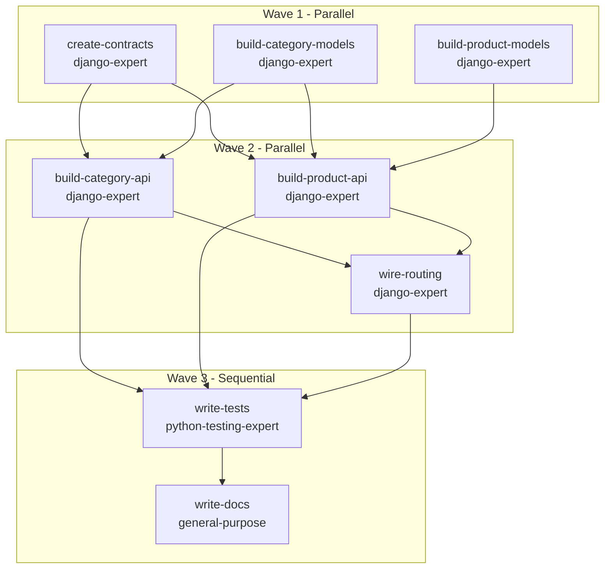
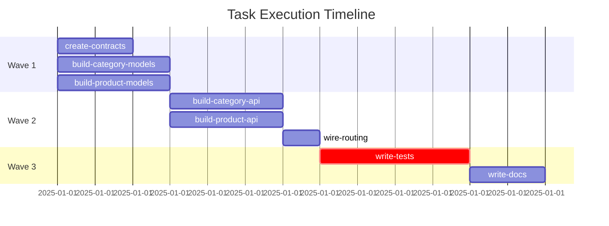

# Plan: Product Catalog REST API

## Task Description

Implement a complete Django REST API for a product catalog system that allows users to manage products, categories, and inventory levels. The API should support CRUD operations, filtering, search, and proper validation with comprehensive test coverage.

## Objective

Create a production-ready product catalog REST API with Django REST Framework that includes models, serializers, views, URL routing, comprehensive tests, and API documentation.

## Problem Statement

The system currently lacks a structured way to manage product information. Users need an API to create, read, update, and delete products with proper categorization and inventory tracking. The API must be well-tested, documented, and follow Django and REST API best practices.

## Solution Approach

We'll implement a multi-app Django architecture with separate apps for products and categories. The solution uses Django REST Framework for API endpoints, factory_boy for test fixtures, and pytest for testing. We'll leverage parallel execution for independent components (models, views, serializers) and sequential waves for dependent components (tests, documentation).

## Relevant Files

Use these files to complete the task:

- `config/settings/base.py` - Add new apps to INSTALLED_APPS and configure REST framework settings
- `config/urls.py` - Register API router and include app URLs
- `pytest.ini` - Pytest configuration for test discovery and settings

### New Files

- `contracts/types.py` - Shared data types, enums, and DTOs for cross-app consistency
- `apps/products/models.py` - Product model with category foreign key and inventory tracking
- `apps/products/serializers.py` - Product serializers for API request/response
- `apps/products/views.py` - Product viewsets with filtering and search
- `apps/products/urls.py` - Product API URL routing
- `apps/products/factories.py` - Factory_boy fixtures for product testing
- `apps/products/tests/test_models.py` - Product model unit tests
- `apps/products/tests/test_api.py` - Product API integration tests
- `apps/categories/models.py` - Category model for product organization
- `apps/categories/serializers.py` - Category serializers for API
- `apps/categories/views.py` - Category viewsets
- `apps/categories/urls.py` - Category API URL routing
- `apps/categories/factories.py` - Factory_boy fixtures for category testing
- `apps/categories/tests/test_models.py` - Category model unit tests
- `apps/categories/tests/test_api.py` - Category API integration tests
- `docs/api-endpoints.md` - API endpoint documentation with examples

## Contracts

When multiple agents work in parallel or integrate across API boundaries, shared contracts ensure consistency.

### Shared Types (contracts/types.py)

```python
from dataclasses import dataclass
from typing import Optional
from datetime import datetime
from enum import Enum

class ProductStatus(str, Enum):
    ACTIVE = "active"
    INACTIVE = "inactive"
    DISCONTINUED = "discontinued"

class StockLevel(str, Enum):
    IN_STOCK = "in_stock"
    LOW_STOCK = "low_stock"
    OUT_OF_STOCK = "out_of_stock"

@dataclass
class ProductDTO:
    id: int
    name: str
    description: str
    price: float
    category_id: int
    category_name: str
    status: ProductStatus
    stock_quantity: int
    stock_level: StockLevel
    created_at: datetime
    updated_at: datetime

@dataclass
class CategoryDTO:
    id: int
    name: str
    description: Optional[str]
    product_count: int
    created_at: datetime

@dataclass
class ProductCreateRequest:
    name: str
    description: str
    price: float
    category_id: int
    status: ProductStatus
    stock_quantity: int

@dataclass
class CategoryCreateRequest:
    name: str
    description: Optional[str]
```

### API Schema (contracts/api-schema.yaml)

```yaml
openapi: 3.0.0
info:
  title: Product Catalog API
  version: 1.0.0
  description: REST API for managing products and categories

components:
  schemas:
    Product:
      type: object
      required: [id, name, price, category_id, status, stock_quantity]
      properties:
        id: {type: integer}
        name: {type: string, minLength: 1, maxLength: 200}
        description: {type: string}
        price: {type: number, format: decimal, minimum: 0}
        category_id: {type: integer}
        category_name: {type: string, readOnly: true}
        status: {type: string, enum: [active, inactive, discontinued]}
        stock_quantity: {type: integer, minimum: 0}
        stock_level: {type: string, enum: [in_stock, low_stock, out_of_stock], readOnly: true}
        created_at: {type: string, format: date-time, readOnly: true}
        updated_at: {type: string, format: date-time, readOnly: true}

    Category:
      type: object
      required: [id, name]
      properties:
        id: {type: integer}
        name: {type: string, minLength: 1, maxLength: 100}
        description: {type: string}
        product_count: {type: integer, readOnly: true}
        created_at: {type: string, format: date-time, readOnly: true}

    ProductCreateRequest:
      type: object
      required: [name, price, category_id, status, stock_quantity]
      properties:
        name: {type: string, minLength: 1, maxLength: 200}
        description: {type: string}
        price: {type: number, format: decimal, minimum: 0}
        category_id: {type: integer}
        status: {type: string, enum: [active, inactive, discontinued]}
        stock_quantity: {type: integer, minimum: 0}

    CategoryCreateRequest:
      type: object
      required: [name]
      properties:
        name: {type: string, minLength: 1, maxLength: 100}
        description: {type: string}

paths:
  /api/products:
    get:
      summary: List products
      parameters:
        - name: category_id
          in: query
          schema: {type: integer}
        - name: status
          in: query
          schema: {type: string, enum: [active, inactive, discontinued]}
        - name: search
          in: query
          schema: {type: string}
      responses:
        '200':
          description: Product list
          content:
            application/json:
              schema:
                type: array
                items:
                  $ref: '#/components/schemas/Product'
    post:
      summary: Create product
      requestBody:
        required: true
        content:
          application/json:
            schema:
              $ref: '#/components/schemas/ProductCreateRequest'
      responses:
        '201':
          description: Product created
          content:
            application/json:
              schema:
                $ref: '#/components/schemas/Product'

  /api/products/{id}:
    get:
      summary: Retrieve product
      parameters:
        - name: id
          in: path
          required: true
          schema: {type: integer}
      responses:
        '200':
          description: Product detail
          content:
            application/json:
              schema:
                $ref: '#/components/schemas/Product'
    put:
      summary: Update product
      parameters:
        - name: id
          in: path
          required: true
          schema: {type: integer}
      requestBody:
        required: true
        content:
          application/json:
            schema:
              $ref: '#/components/schemas/ProductCreateRequest'
      responses:
        '200':
          description: Product updated
    delete:
      summary: Delete product
      parameters:
        - name: id
          in: path
          required: true
          schema: {type: integer}
      responses:
        '204':
          description: Product deleted

  /api/categories:
    get:
      summary: List categories
      responses:
        '200':
          description: Category list
          content:
            application/json:
              schema:
                type: array
                items:
                  $ref: '#/components/schemas/Category'
    post:
      summary: Create category
      requestBody:
        required: true
        content:
          application/json:
            schema:
              $ref: '#/components/schemas/CategoryCreateRequest'
      responses:
        '201':
          description: Category created

  /api/categories/{id}:
    get:
      summary: Retrieve category
      parameters:
        - name: id
          in: path
          required: true
          schema: {type: integer}
      responses:
        '200':
          description: Category detail
    put:
      summary: Update category
      parameters:
        - name: id
          in: path
          required: true
          schema: {type: integer}
      requestBody:
        required: true
        content:
          application/json:
            schema:
              $ref: '#/components/schemas/CategoryCreateRequest'
      responses:
        '200':
          description: Category updated
    delete:
      summary: Delete category
      parameters:
        - name: id
          in: path
          required: true
          schema: {type: integer}
      responses:
        '204':
          description: Category deleted
```

## Implementation Phases

### Phase 1: Foundation

Create shared contracts (types.py, api-schema.yaml) and category models. Categories are foundational as products depend on them via foreign key.

### Phase 2: Core Implementation

Build product models, serializers, and views in parallel with category serializers and views. All components reference shared contracts for consistency.

### Phase 3: Integration & Polish

Wire up URL routing, write comprehensive tests for both apps, generate API documentation, and validate the entire system.

## Team Orchestration

- You operate as the team lead and orchestrate the team to execute the plan.
- You're responsible for deploying the right team members with the right context to execute the plan.
- IMPORTANT: You NEVER operate directly on the codebase. You use `Task` and `Task*` tools to deploy team members to do the building, validating, testing, deploying, and other tasks.
  - This is critical. Your job is to act as a high level director of the team, not a builder.
  - Your role is to validate all work is going well and make sure the team is on track to complete the plan.
  - You'll orchestrate this by using the Task* Tools to manage coordination between the team members.
  - Communication is paramount. You'll use the Task* Tools to communicate with the team members and ensure they're on track to complete the plan.
- Take note of the session id of each team member. This is how you'll reference them.

### Team Members

- Builder: Category Expert
  - Name: builder-categories
  - Role: Implement category models, serializers, views, and tests
  - Agent Type: django-expert
  - Resume: true
- Builder: Product Expert
  - Name: builder-products
  - Role: Implement product models, serializers, views, and tests
  - Agent Type: django-expert
  - Resume: true
- Builder: API Integration Expert
  - Name: builder-api-integration
  - Role: Wire up URL routing, configure settings, integrate components
  - Agent Type: django-expert
  - Resume: true
- Tester: API Testing Expert
  - Name: tester-api
  - Role: Write comprehensive API integration tests for both apps
  - Agent Type: python-testing-expert
  - Resume: true
- Documentation Writer
  - Name: docs-writer
  - Role: Generate API documentation with endpoint examples
  - Agent Type: general-purpose
  - Resume: false

### File Ownership Matrix

Track which tasks create or modify which files to prevent merge conflicts in parallel execution.

| File | CREATE | MODIFY Scope | Task ID | Wave |
|------|--------|--------------|---------|------|
| `contracts/types.py` | create-contracts | - | create-contracts | 1 |
| `contracts/api-schema.yaml` | create-contracts | - | create-contracts | 1 |
| `apps/categories/models.py` | build-category-models | - | build-category-models | 1 |
| `apps/categories/factories.py` | build-category-models | - | build-category-models | 1 |
| `apps/categories/tests/test_models.py` | build-category-models | - | build-category-models | 1 |
| `apps/products/models.py` | build-product-models | - | build-product-models | 1 |
| `apps/products/factories.py` | build-product-models | - | build-product-models | 1 |
| `apps/products/tests/test_models.py` | build-product-models | - | build-product-models | 1 |
| `apps/categories/serializers.py` | build-category-api | - | build-category-api | 2 |
| `apps/categories/views.py` | build-category-api | - | build-category-api | 2 |
| `apps/categories/urls.py` | build-category-api | - | build-category-api | 2 |
| `apps/products/serializers.py` | build-product-api | - | build-product-api | 2 |
| `apps/products/views.py` | build-product-api | - | build-product-api | 2 |
| `apps/products/urls.py` | build-product-api | - | build-product-api | 2 |
| `config/settings/base.py::INSTALLED_APPS` | - | wire-routing | wire-routing | 2 |
| `config/settings/base.py::REST_FRAMEWORK` | - | wire-routing | wire-routing | 2 |
| `config/urls.py` | - | wire-routing | wire-routing | 2 |
| `apps/products/tests/test_api.py` | write-tests | - | write-tests | 3 |
| `apps/categories/tests/test_api.py` | write-tests | - | write-tests | 3 |
| `docs/api-endpoints.md` | write-docs | - | write-docs | 3 |

**Ownership Rules:**
- **CREATE**: A file can be created by exactly ONE task across all waves
- **MODIFY (unscoped)**: Only ONE task per wave can modify a file without scope (file.py)
- **MODIFY (scoped)**: Multiple tasks can modify the same file in parallel IF they own distinct scopes (file.py::function_name, file.py::ClassName.method)
- **No overlapping scopes**: file.py::ClassName and file.py::ClassName.method conflict in the same wave
- **Sequential waves**: Later waves can modify files created in earlier waves

## Step by Step Tasks

- IMPORTANT: Execute every step in order, top to bottom. Each task maps directly to a `TaskCreate` call.
- Before you start, run `TaskCreate` to create the initial task list that all team members can see and execute.

### 1. Create Shared Contracts

- **Task ID**: create-contracts
- **Wave**: 1
- **Depends On**: none
- **Assigned To**: builder-categories
- **Agent Type**: django-expert
- **Parallel**: true
- **File Ownership**:
  - **CREATE**: contracts/types.py, contracts/api-schema.yaml
  - **MODIFY**: -
  - **BOUNDARY**: apps/* (not yet created)
- Create `contracts/types.py` with ProductStatus, StockLevel, ProductDTO, CategoryDTO enums and dataclasses
- Create `contracts/api-schema.yaml` with OpenAPI 3.0 schema for all endpoints
- Ensure types match exactly between Python DTOs and OpenAPI schemas
- Add docstrings explaining the purpose of each contract type

### 2. Build Category Models

- **Task ID**: build-category-models
- **Wave**: 1
- **Depends On**: none
- **Assigned To**: builder-categories
- **Agent Type**: django-expert
- **Parallel**: true
- **File Ownership**:
  - **CREATE**: apps/categories/models.py, apps/categories/factories.py, apps/categories/tests/test_models.py
  - **MODIFY**: -
  - **BOUNDARY**: apps/products/* (owned by build-product-models), config/* (owned by wire-routing)
- Create Category model with name, description, created_at fields
- Add __str__ method and Meta ordering
- Implement product_count property to count related products
- Create CategoryFactory using factory_boy
- Write unit tests for Category model validation and product_count property

### 3. Build Product Models

- **Task ID**: build-product-models
- **Wave**: 1
- **Depends On**: none
- **Assigned To**: builder-products
- **Agent Type**: django-expert
- **Parallel**: true
- **File Ownership**:
  - **CREATE**: apps/products/models.py, apps/products/factories.py, apps/products/tests/test_models.py
  - **MODIFY**: -
  - **BOUNDARY**: apps/categories/* (owned by build-category-models), config/* (owned by wire-routing)
- Create Product model with name, description, price, category (ForeignKey), status, stock_quantity, created_at, updated_at
- Use ProductStatus enum from contracts/types.py
- Implement stock_level property that returns StockLevel enum based on stock_quantity (>10: IN_STOCK, 1-10: LOW_STOCK, 0: OUT_OF_STOCK)
- Add __str__ method and Meta ordering by name
- Create ProductFactory using factory_boy with SubFactory for category
- Write unit tests for Product model validation, stock_level logic, and category relationship

### 4. Build Category API Layer

- **Task ID**: build-category-api
- **Wave**: 2
- **Depends On**: build-category-models, create-contracts
- **Assigned To**: builder-categories
- **Agent Type**: django-expert
- **Parallel**: true
- **File Ownership**:
  - **CREATE**: apps/categories/serializers.py, apps/categories/views.py, apps/categories/urls.py
  - **MODIFY**: -
  - **BOUNDARY**: apps/products/* (owned by build-product-api), config/* (owned by wire-routing)
- Create CategorySerializer with all fields from CategoryDTO
- Add product_count as SerializerMethodField
- Create CategoryViewSet with list, retrieve, create, update, destroy actions
- Configure URL router in apps/categories/urls.py
- Use consistent naming from contracts/api-schema.yaml

### 5. Build Product API Layer

- **Task ID**: build-product-api
- **Wave**: 2
- **Depends On**: build-product-models, build-category-models, create-contracts
- **Assigned To**: builder-products
- **Agent Type**: django-expert
- **Parallel**: true
- **File Ownership**:
  - **CREATE**: apps/products/serializers.py, apps/products/views.py, apps/products/urls.py
  - **MODIFY**: -
  - **BOUNDARY**: apps/categories/* (owned by build-category-api), config/* (owned by wire-routing)
- Create ProductSerializer with all fields from ProductDTO
- Add category_name as SerializerMethodField to include category name
- Include stock_level as read-only field
- Create ProductViewSet with CRUD actions
- Add filtering by category_id and status using django-filter
- Add search capability on name and description using SearchFilter
- Configure URL router in apps/products/urls.py
- Reference contracts/api-schema.yaml for endpoint structure

### 6. Wire Up Routing and Settings

- **Task ID**: wire-routing
- **Wave**: 2
- **Depends On**: build-category-api, build-product-api
- **Assigned To**: builder-api-integration
- **Agent Type**: django-expert
- **Parallel**: true
- **File Ownership**:
  - **CREATE**: -
  - **MODIFY**: config/settings/base.py::INSTALLED_APPS, config/settings/base.py::REST_FRAMEWORK, config/urls.py
  - **BOUNDARY**: apps/* (all app code owned by other tasks)
- Add 'apps.products' and 'apps.categories' to INSTALLED_APPS in config/settings/base.py
- Add 'rest_framework' and 'django_filters' to INSTALLED_APPS if not present
- Configure REST_FRAMEWORK settings for pagination, filtering, and search
- Include product and category API URLs in config/urls.py under /api/ prefix
- Ensure URL patterns match contracts/api-schema.yaml paths

### 7. Write Comprehensive API Tests

- **Task ID**: write-tests
- **Wave**: 3
- **Depends On**: build-category-api, build-product-api, wire-routing
- **Assigned To**: tester-api
- **Agent Type**: python-testing-expert
- **Parallel**: false
- **File Ownership**:
  - **CREATE**: apps/products/tests/test_api.py, apps/categories/tests/test_api.py
  - **MODIFY**: -
  - **BOUNDARY**: apps/products/models.py (cannot modify), apps/categories/models.py (cannot modify)
- Write API integration tests for Category endpoints (list, retrieve, create, update, delete)
- Write API integration tests for Product endpoints with filtering and search
- Test product_count in category responses
- Test stock_level calculation in product responses
- Test category_name appears in product responses
- Verify all validation rules from contracts/api-schema.yaml
- Use factories for test data creation
- Ensure 100% coverage of API views

### 8. Generate API Documentation

- **Task ID**: write-docs
- **Wave**: 3
- **Depends On**: build-category-api, build-product-api, write-tests
- **Assigned To**: docs-writer
- **Agent Type**: general-purpose
- **Parallel**: false
- **File Ownership**:
  - **CREATE**: docs/api-endpoints.md
  - **MODIFY**: -
  - **BOUNDARY**: apps/* (all app code), config/* (all config)
- Create comprehensive API documentation in docs/api-endpoints.md
- Document all endpoints from contracts/api-schema.yaml with curl examples
- Include request/response examples for each endpoint
- Document query parameters for filtering and search
- Add examples of error responses
- Include authentication requirements (if any)

## Task Dependency Graph

Visualize task dependencies and wave execution order with Mermaid.

### Dependency Flowchart



### Execution Timeline



## Acceptance Criteria

- Category and Product models are created with proper fields and relationships
- Category has product_count property that counts related products
- Product has stock_level property that returns correct StockLevel enum
- REST API endpoints exist for both categories and products with CRUD operations
- Products can be filtered by category_id and status
- Products can be searched by name and description
- All API responses match the contracts/api-schema.yaml specification
- ProductDTO and CategoryDTO types are used consistently across apps
- Test coverage is 100% for models and API views
- API documentation is complete with curl examples for all endpoints
- No merge conflicts between parallel tasks (validated by File Ownership Matrix)

## Validation Commands

Execute these commands to validate the task is complete:

- `uv run python manage.py makemigrations --check --dry-run` - Verify no missing migrations
- `uv run python manage.py check` - Django system check for configuration errors
- `uv run pytest apps/categories/tests/ -v` - Run category tests
- `uv run pytest apps/products/tests/ -v` - Run product tests
- `uv run pytest apps/ --cov=apps --cov-report=term-missing` - Verify 100% test coverage
- `uv run mypy apps/categories apps/products` - Type checking with mypy
- `uv run python -m py_compile apps/categories/*.py apps/products/*.py` - Verify Python syntax
- `curl http://localhost:8000/api/products/ | jq .` - Test product list endpoint
- `curl http://localhost:8000/api/categories/ | jq .` - Test category list endpoint

## Orchestration Validation Checklist

Before executing this plan, validate the orchestration structure to prevent merge conflicts and ensure efficient parallel execution.

### File Ownership Validation

- [x] **CREATE exclusivity**: Each file appears in CREATE for at most ONE task across all waves
- [x] **MODIFY scope**: Parallel tasks modifying the same file use scoped syntax (config/settings/base.py::INSTALLED_APPS)
- [x] **No overlapping scopes**: No two tasks in the same wave modify overlapping scopes (wire-routing is the only task modifying config files in Wave 2)
- [x] **File ownership matrix**: Matrix is complete and accurate for all 8 tasks
- [x] **BOUNDARY clarity**: Each task explicitly lists files it CANNOT touch

### Dependencies Validation

- [x] **No circular dependencies**: All dependencies flow forward (Wave 1 → Wave 2 → Wave 3)
- [x] **Wave ordering**: All dependencies point to earlier wave tasks (Wave 2 depends on Wave 1, Wave 3 depends on Wave 2)
- [x] **Parallel safety**: Tasks marked parallel=true have no dependencies on each other within the same wave
- [x] **Dependency graph**: Mermaid flowchart accurately represents all task dependencies
- [x] **Critical path identified**: create-contracts → build-product-api → wire-routing → write-tests → write-docs (16 hours)

### Task Sizing Validation

- [x] **Granularity**: Each task is 1-4 hours of work (create-contracts: 2h, build-*-models: 3h, build-*-api: 3h, wire-routing: 1h, write-tests: 4h, write-docs: 2h)
- [x] **Single focus**: Each task has one clear objective (contracts, models, API layer, routing, tests, docs)
- [x] **Complete ownership**: Each task has all files it needs in CREATE/MODIFY (verified in File Ownership Matrix)
- [x] **Testable**: Each task has clear validation criteria in Acceptance Criteria
- [x] **Agent match**: Complex tasks use django-expert, testing uses python-testing-expert, docs use general-purpose

### Team Capacity Validation

- [x] **Team members defined**: All 5 team members listed with roles and agent types
- [x] **Assignments complete**: Every task assigned to a team member
- [x] **Workload balanced**: builder-categories has 2 tasks (5h), builder-products has 2 tasks (6h), builder-api-integration has 1 task (1h), tester-api has 1 task (4h), docs-writer has 1 task (2h)
- [x] **Agent types valid**: django-expert, python-testing-expert, general-purpose all exist
- [x] **Resume strategy**: Resume=true for builders (context continuity), Resume=false for docs-writer (one-off task)

## Notes

This plan demonstrates the enhanced orchestration features:

1. **Contracts Section**: Defines shared types.py and api-schema.yaml to ensure consistency across parallel agents
2. **File Ownership Matrix**: Complete table showing no conflicts - Wave 1 tasks create different files, Wave 2 has scoped MODIFY for config files
3. **Enhanced Task Metadata**: All 8 tasks include Wave, File Ownership (CREATE/MODIFY/BOUNDARY), and dependencies
4. **Dependency Graph**: Mermaid flowchart shows 3 waves with parallel execution within waves
5. **Orchestration Validation**: Complete 4-category checklist with all items checked

The plan leverages parallel execution effectively:
- Wave 1: 3 tasks run in parallel (contracts, category models, product models)
- Wave 2: 3 tasks run in parallel (category API, product API, wire routing)
- Wave 3: 2 tasks run sequentially (tests must complete before docs)

Dependencies are minimal and well-structured to maximize parallelism while maintaining correctness.
